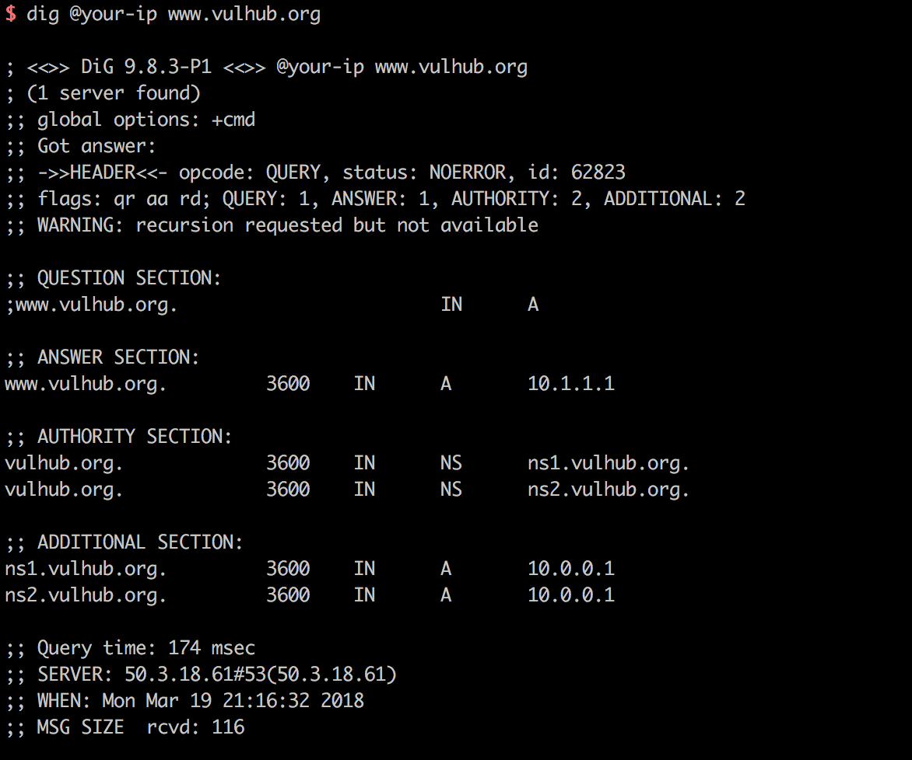
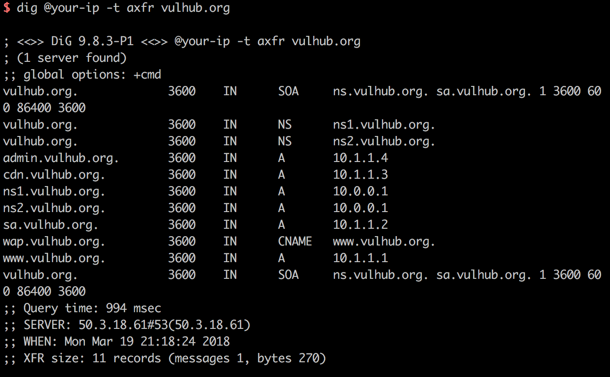
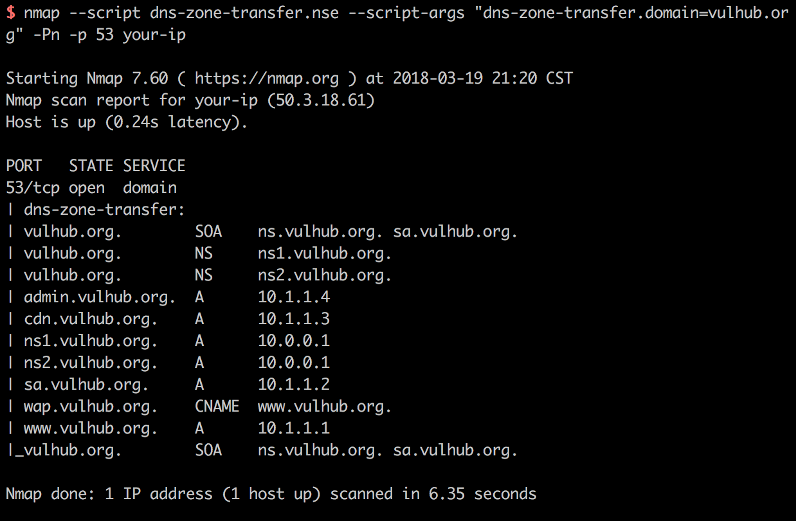

# DNS域传送漏洞

DNS协议支持使用axfr类型的记录进行区域传送，用来解决主从同步的问题。如果管理员在配置DNS服务器的时候没有限制允许获取记录的来源，将会导致DNS域传送漏洞。

参考链接：

- https://www.acunetix.com/blog/articles/dns-zone-transfers-axfr/
- https://nmap.org/nsedoc/scripts/dns-zone-transfer.html

## 环境搭建

Vulhub使用[Bind9](https://wiki.debian.org/Bind9)来搭建dns服务器，但不代表只有Bind9支持AXFR记录。运行DNS服务器：

```
docker-compose up -d
```

环境运行后，将会监听TCP和UDP的53端口，DNS协议同时支持从这两个端口进行数据传输。

## 漏洞复现

在Linux下，我们可以使用dig命令来发送dns请求。比如，我们可以用`dig @your-ip www.vulhub.org`获取域名`www.vulhub.org`在目标dns服务器上的A记录：



发送axfr类型的dns请求：`dig @your-ip -t axfr vulhub.org`



可见，我获取到了`vulhub.org`的所有子域名记录，这里存在DNS域传送漏洞。

我们也可以用nmap script来扫描该漏洞：`nmap --script dns-zone-transfer.nse --script-args "dns-zone-transfer.domain=vulhub.org" -Pn -p 53 your-ip`


