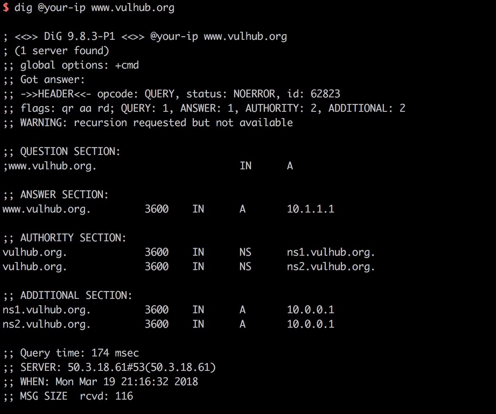
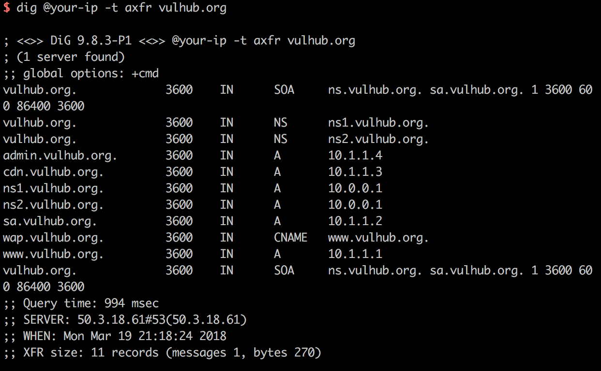
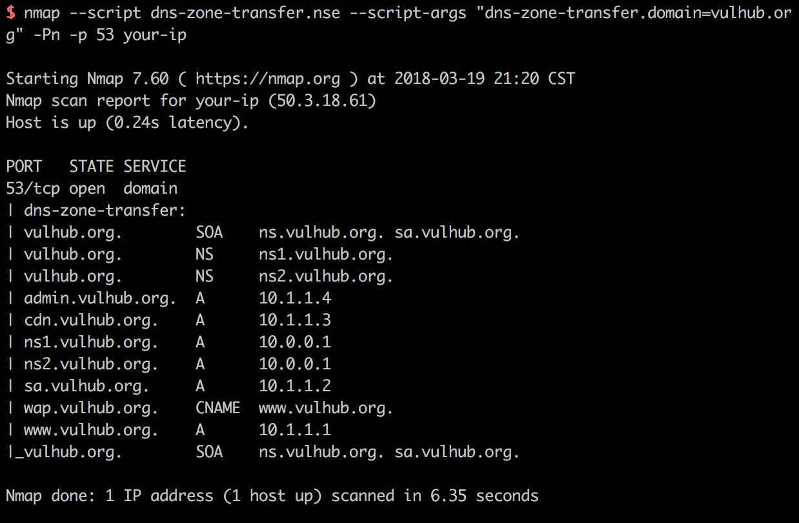

# DNS 域传送漏洞

DNS 协议支持使用 axfr 类型的记录进行区域传送，用来解决主从同步的问题。如果管理员在配置 DNS 服务器的时候没有限制允许获取记录的来源，将会导致 DNS 域传送漏洞。

参考链接：

- https://www.acunetix.com/blog/articles/dns-zone-transfers-axfr/
- https://nmap.org/nsedoc/scripts/dns-zone-transfer.html

## 环境搭建

Vulhub 使用 [Bind9](https://wiki.debian.org/Bind9) 来搭建 dns 服务器，但不代表只有 Bind9 支持 AXFR 记录。运行 DNS 服务器：

```
docker compose up -d
```

环境运行后，将会监听 TCP 和 UDP 的 53 端口，DNS 协议同时支持从这两个端口进行数据传输。

## 漏洞复现

在 Linux 下，我们可以使用 dig 命令来发送 dns 请求。比如，我们可以用 `dig @your-ip www.vulhub.org` 获取域名 `www.vulhub.org` 在目标 dns 服务器上的 A 记录：



发送 axfr 类型的 dns 请求：`dig @your-ip -t axfr vulhub.org`



可见，我获取到了 `vulhub.org` 的所有子域名记录，这里存在 DNS 域传送漏洞。

我们也可以用 nmap script 来扫描该漏洞：`nmap --script dns-zone-transfer.nse --script-args "dns-zone-transfer.domain=vulhub.org" -Pn -p 53 your-ip`


