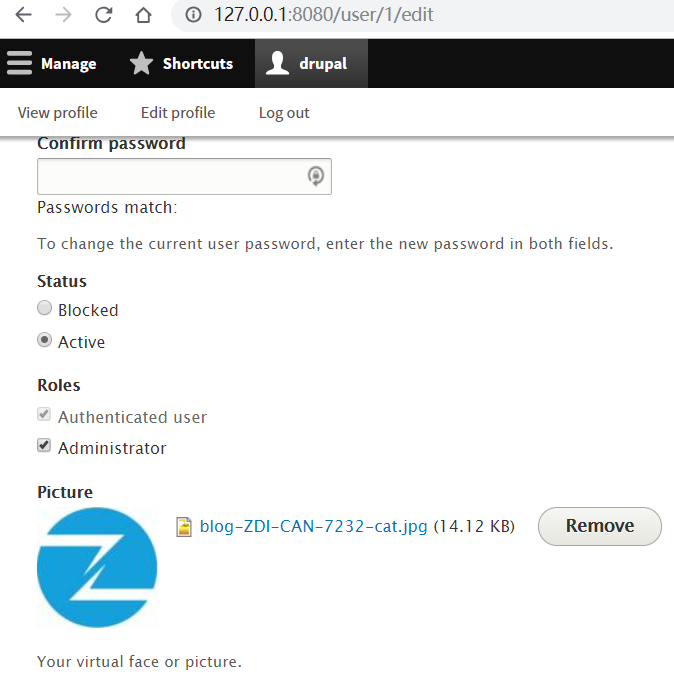
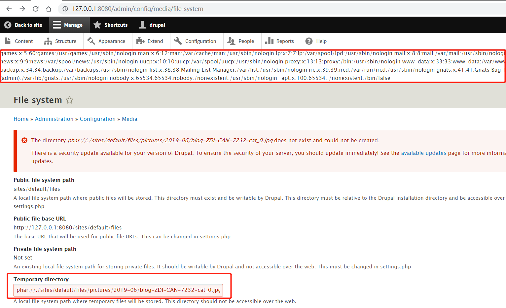

# Drupal 远程代码执行漏洞（CVE-2019-6339）

* 影响软件：Drupal
* 方式：phar反序列化RCE
* 参考链接：[Drupal 1-click to RCE 分析](https://paper.seebug.org/897/)
* 效果：任意命令执行

## 漏洞环境

执行如下命令启动drupal 8.5.0的环境：

```bash
docker-compose up -d
```

环境启动后，访问 `http://your-ip:8080/` 将会看到drupal的安装页面，一路默认配置下一步安装。因为没有mysql环境，所以安装的时候可以选择sqlite数据库。

## 漏洞复现

如下图所示，先使用管理员用户上传头像，头像图片为构造好的 PoC，参考[thezdi/PoC](https://github.com/thezdi/PoC/tree/master/Drupal)的PoC。



Drupal 的图片默认存储位置为 `/sites/default/files/pictures/<YYYY-MM>/`，默认存储名称为其原来的名称，所以之后在利用漏洞时，可以知道上传后的图片的具体位置。

访问 `http://127.0.0.1:8080/admin/config/media/file-system`，在 `Temporary directory` 处输入之前上传的图片路径，示例为 `phar://./sites/default/files/pictures/2019-06/blog-ZDI-CAN-7232-cat_0.jpg`，保存后将触发该漏洞。如下图所示，触发成功。


