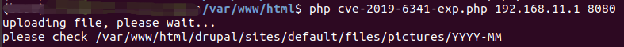
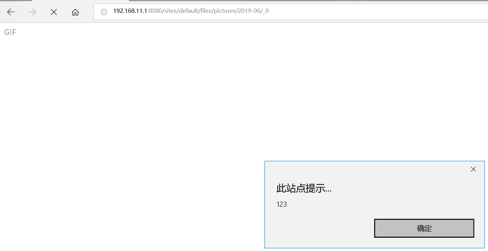

# Drupal XSS漏洞（CVE-2019-6341）

* 影响软件：Drupal
* 方式：通过文件模块或者子系统上传恶意文件触发XSS漏洞
* 参考链接：[Drupal 1-click to RCE 分析](https://paper.seebug.org/897/)
* 效果：JS代码执行（Cookies 资料窃取、会话劫持、钓鱼欺骗、网页挂马等）

## 漏洞环境

执行如下命令启动drupal 8.5.0的环境：

```bash
docker-compose up -d
```

环境启动后，访问 `http://your-ip:8080/` 将会看到drupal的安装页面，一路默认配置下一步安装。因为没有mysql环境，所以安装的时候可以选择sqlite数据库。

## 漏洞复现

该漏洞需要利用drupal文件模块上传文件的漏洞，伪造一个图片文件，上传，文件的内容实际是一段HTML代码，内嵌JS，这样其他用户在访问这个链接时，就可能触发XSS漏洞。

Drupal 的图片默认存储位置为 `/sites/default/files/pictures/<YYYY-MM>/`，默认存储名称为其原来的名称，所以之后在利用漏洞时，可以知道上传后的图片的具体位置。

使用PoC上传构造好的伪造GIF文件，PoC参考[thezdi/PoC](https://github.com/thezdi/PoC/tree/master/Drupal)的PoC。

如图，输入如下命令，即可使用PoC构造样本并完成上传功能，第一个参数为目标IP 第二个参数为目标端口。

```bash
php cve-2019-6341-exp.php 192.168.11.1 8080
```



上传成功后，访问图片位置，即可触发 XSS 漏洞，如下图所示。

Tips:

1. 因为 Chrome 和 FireFox 浏览器自带部分过滤 XSS 功能，所以验证存在时可使用 Edge 浏览器或者 IE 浏览器。
2. 访问的图片名称为_0的原因是因为 Drupal 的规则机制，具体原理见[Drupal 1-click to RCE 分析](https://paper.seebug.org/897/)


