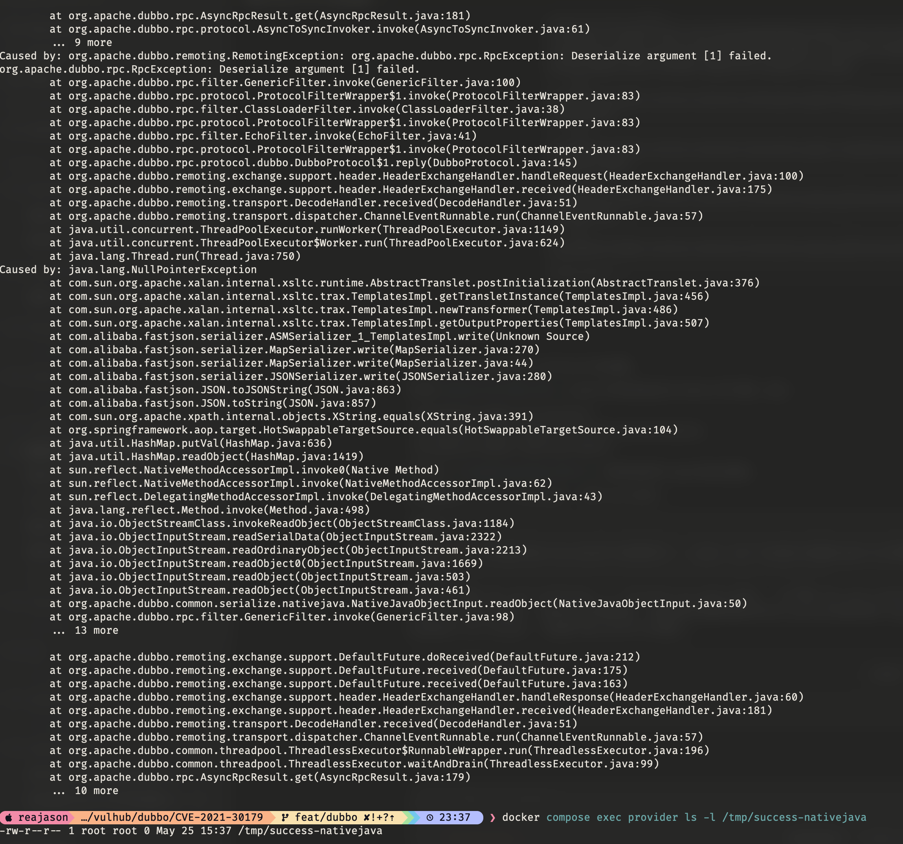

# Apache Dubbo GenericFilter Native Java Deserialization Remote Code Execution (CVE-2021-30179)

[中文版本(Chinese version)](README.zh-cn.md)

Apache Dubbo is a high-performance Java RPC framework.

Apache Dubbo versions prior to 2.6.9 and 2.7.10 are affected by a deserialization vulnerability in provider-side generic calls. When a caller sends a `$invoke` or `$invokeAsync` request, `GenericFilter` reads the caller-controlled `generic` attachment to decide how to decode method arguments. An unauthenticated attacker can set this attachment to `nativejava`, causing the provider to deserialize a byte array with Java native serialization and potentially execute arbitrary code.

References:

- <https://nvd.nist.gov/vuln/detail/CVE-2021-30179>
- <https://lists.apache.org/thread.html/rccbcbdd6593e42ea3a1e8fedd12807cb111375c9c40edb005ef36f67%40%3Cdev.dubbo.apache.org%3E>
- <https://securitylab.github.com/advisories/GHSL-2021-034_043-apache-dubbo/>

## Environment Setup

Execute the following command to start Apache Dubbo 2.7.9:

```
docker compose up -d
```

After the service starts, the Dubbo provider listens on `your-ip:20880`. This environment uses `N/A` as the registry address, so ZooKeeper or other registry services are not required.

## Vulnerability Reproduction

Build the external Dubbo PoC JAR first with Java 8:

```
(cd ../../base/dubbo/poc && mvn clean package)
```

The PoC creates a generic Dubbo RPC client outside the provider container. The client calls the exported `org.vulhub.api.CalcService` service through `$invoke`, sets the generic serialization mode to `nativejava`, and sends a Java-serialized Fastjson gadget payload as the first argument to the provider.

Send the payload to the provider:

```
java -jar ../../base/dubbo/poc/target/dubbo-poc-1.0-SNAPSHOT.jar CVE-2021-30179 127.0.0.1 20880
```

The client may print a Dubbo invocation or deserialization exception after sending the payload. This is expected for this demonstration; the exploit result is verified on the provider side.

After the payload is sent, verify command execution inside the provider container:

```
docker compose exec provider ls -l /tmp/success-nativejava
```

The presence of `/tmp/success-nativejava` confirms that the provider accepted the caller-controlled `nativejava` generic attachment and deserialized attacker-controlled bytes on the provider side.


