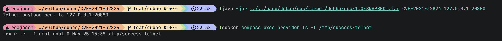

# Apache Dubbo Telnet Handler PojoUtils 远程命令执行漏洞（CVE-2021-32824）

Apache Dubbo 是一款高性能 Java RPC 服务框架。

Apache Dubbo 2.6.10 之前版本以及 2.7.10 之前版本中，Provider Telnet Handler 存在未授权远程命令执行漏洞。Dubbo 主服务端口会暴露旧版 Telnet 命令，其中 `invoke` 命令会先使用 Fastjson 解析参数，再通过 `PojoUtils.realize` 将参数转换为方法参数类型。虽然 Fastjson 本身带有黑名单保护，但 `PojoUtils.realize` 会根据调用者可控的 `class` 字段实例化任意类并调用 setter，最终可能导致远程命令执行。

参考链接：

- <https://nvd.nist.gov/vuln/detail/CVE-2021-32824>
- <https://securitylab.github.com/advisories/GHSL-2021-034_043-apache-dubbo/>

## 环境搭建

执行如下命令启动 Apache Dubbo 2.7.9：

```
docker compose up -d
```

服务启动后，Dubbo Provider 会监听 `your-ip:20880`。这个环境将注册中心地址设置为 `N/A`，因此不需要 ZooKeeper 或其他注册中心服务。

## 漏洞复现

先使用 Java 8 构建外部 Dubbo PoC JAR：

```
(cd ../../base/dubbo/poc && mvn clean package)
```

PoC 会从 Provider 容器外通过 Dubbo Telnet 协议连接 Provider 服务端口。它发送一条 `invoke org.vulhub.api.CalcService.echo(...)` 命令，其中 JSON 参数包含调用者可控的 `class` 字段，并指向 JDK 自带的 `TemplatesImpl` 类。Telnet Handler 会先用 Fastjson 解析参数，然后将解析后的对象传给 `PojoUtils.realize`，从而实例化指定类并填充字段。当 Handler 将返回值重新序列化为 JSON 时，`TemplatesImpl` 的 getter 路径会加载注入的字节码并执行命令。

向 Provider 发送 Telnet payload：

```
java -jar ../../base/dubbo/poc/target/dubbo-poc-1.0-SNAPSHOT.jar CVE-2021-32824 127.0.0.1 20880
```

发送 payload 后，进入 Provider 容器验证命令执行结果：

```
docker compose exec provider ls -l /tmp/success-telnet
```

如果可以看到 `/tmp/success-telnet` 文件，即说明未授权 Telnet `invoke` Handler 进入了 `PojoUtils.realize`，并触发了攻击者控制的 Bean 属性赋值。


