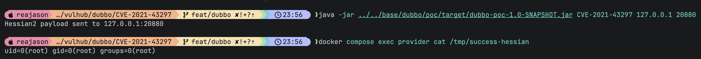
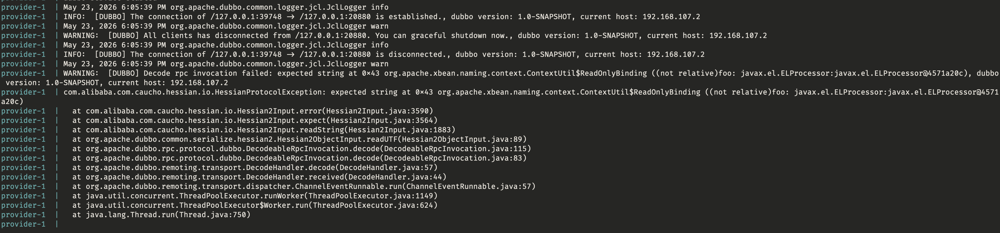

# Apache Dubbo Hessian2 反序列化远程命令执行漏洞（CVE-2021-43297）

Apache Dubbo 是一款高性能 Java RPC 服务框架。

Dubbo Hessian-Lite 3.2.11 及之前版本中存在反序列化漏洞，影响 Apache Dubbo 2.6.12 之前的 2.6.x 版本、2.7.15 之前的 2.7.x 版本以及 3.0.5 之前的 3.0.x 版本。Hessian2 在处理异常序列化数据时，部分错误路径会将攻击者可控对象拼接到日志信息中，从而隐式调用该对象的 `toString` 方法。如果 Provider 的 classpath 中存在可利用的 gadget，能够访问 Dubbo Provider 端口的未授权攻击者即可触发远程命令执行。

参考链接：

- <https://github.com/advisories/GHSA-vp5x-3v8r-qprw>
- <https://api.osv.dev/v1/vulns/CVE-2021-43297>
- <https://exp10it.io/posts/hessian-cve-2021-43297-d3ctf-2023-ezjava/>

## 环境搭建

执行如下命令启动 Apache Dubbo 2.7.9：

```
docker compose up -d
```

服务启动后，Dubbo Provider 会监听 `your-ip:20880`。这个环境将注册中心地址设置为 `N/A`，因此不需要 ZooKeeper 或其他注册中心服务。

## 漏洞复现

先使用 Java 8 构建外部 Dubbo PoC JAR：

```
(cd ../../base/dubbo/poc && mvn clean package)
```

PoC 会在 Provider 容器外构造一段 Hessian2 请求，使服务端进入存在漏洞的异常处理路径，并使用 Provider classpath 中已经存在的 `xbean-naming`、Tomcat `BeanFactory` 和 `ELProcessor` 类完成本地表达式触发。该 PoC 不会加载远程类，默认只会在 Provider 容器内执行安全命令 `id > /tmp/success-hessian`。

向 Provider 发送 Hessian2 payload：

```
java -jar ../../base/dubbo/poc/target/dubbo-poc-1.0-SNAPSHOT.jar CVE-2021-43297 127.0.0.1 20880
```

发送 payload 后，进入 Provider 容器验证命令执行结果：

```
docker compose exec provider cat /tmp/success-hessian
```

如果文件内容中可以看到类似 `uid=0(root)` 的输出，即说明 Hessian2 反序列化异常路径触发了攻击者控制的 `toString` 逻辑，并进入本地 EL 表达式链。



Provider 日志中的报错信息也可以作为漏洞触发成功的证明。异常调用栈中出现了 `Hessian2Input.expect`、`Binding.toString` 和 `ReadOnlyBinding.getObject`，说明畸形 Hessian2 payload 已被反序列化，并在异常处理过程中调用了攻击者可控对象的 `toString` 方法。


