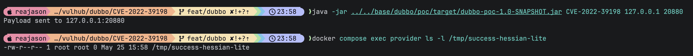

# Apache Dubbo Hessian-Lite Deserialization Remote Code Execution (CVE-2022-39198)

[中文版本(Chinese version)](README.zh-cn.md)

Apache Dubbo is a high-performance Java RPC framework.

A deserialization vulnerability exists in Dubbo Hessian-Lite 3.2.12 and earlier versions, which can lead to malicious code execution. This issue affects Apache Dubbo 2.7.x versions through 2.7.17, 3.0.x versions through 3.0.11, and 3.1.0. An unauthenticated attacker who can reach the Dubbo provider port can send a crafted Hessian2 payload and trigger gadget execution during deserialization.

References:

- <https://lists.apache.org/thread/8d3zqrkoy4jh8dy37j4rd7g9jodzlvkk>
- <https://github.com/advisories/GHSA-5qwq-g2hx-r6f7>
- <https://api.osv.dev/v1/vulns/CVE-2022-39198>
- <https://github.com/apache/dubbo-hessian-lite/releases/tag/v3.2.13>

## Environment Setup

Execute the following command to start Apache Dubbo 3.0.10:

```
docker compose up -d
```

After the service starts, the Dubbo provider listens on `your-ip:20880`. This environment uses `N/A` as the registry address, so ZooKeeper or other registry services are not required.

## Vulnerability Reproduction

Build the external Dubbo PoC JAR first with Java 8:

```
(cd ../../base/dubbo/poc && mvn clean package)
```

The PoC builds a Hessian2 request with a JDK-only gadget payload outside the provider container and sends it directly to the Dubbo provider. The payload uses JDK classes that are available in common Linux Java 8 runtimes; if those classes are absent from your local JDK, run the PoC from a Linux Java 8 environment. The PoC does not load remote classes; by default, it executes the safe command `touch /tmp/success-hessian-lite` inside the provider container.

Send the Hessian2 payload to the provider:

```
java -jar ../../base/dubbo/poc/target/dubbo-poc-1.0-SNAPSHOT.jar CVE-2022-39198 127.0.0.1 20880
```

After the payload is sent, verify command execution inside the provider container:

```
docker compose exec provider ls -l /tmp/success-hessian-lite
```

If the file exists, the Hessian-Lite deserialization payload has been processed and the local command has been executed.


