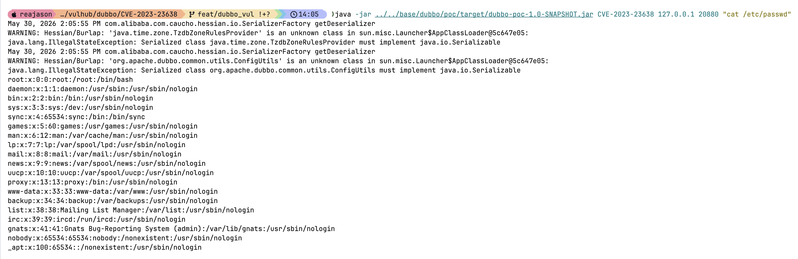

# Apache Dubbo 泛化调用反序列化远程命令执行漏洞（CVE-2023-23638）

Apache Dubbo 是一款高性能 Java RPC 服务框架。

Apache Dubbo Provider 侧泛化调用路径中存在反序列化漏洞。受影响版本中，攻击者可控的泛化调用参数会经过不安全的类型转换。由于 Dubbo 会暴露内置的 `org.apache.dubbo.metadata.MetadataService` 服务，能够访问 Dubbo Provider 端口的未授权攻击者可以通过泛化调用 `MetadataService#getMetadataInfo` 开启危险的 Java 原生反序列化，并在无需知道业务服务名的情况下执行任意代码。该漏洞影响 Apache Dubbo 2.7.x 至 2.7.21、3.0.x 至 3.0.13，以及 3.1.x 至 3.1.5 版本。

参考链接：

- <https://lists.apache.org/thread/dbr28g9t7c7rynn68z13z7v7c4cls6n4>
- <https://github.com/advisories/GHSA-vv7v-5fh5-3cpp>
- <https://nvd.nist.gov/vuln/detail/CVE-2023-23638>
- <https://github.com/apache/dubbo/releases/tag/dubbo-2.7.22>

## 环境搭建

执行如下命令启动 Apache Dubbo 2.7.20：

```
docker compose up -d
```

服务启动后，Dubbo Provider 会监听 `your-ip:20880`。这个环境将注册中心地址设置为 `N/A`，因此不需要 ZooKeeper 或其他注册中心服务。同时，Provider 会暴露版本为 `1.0.0` 的内置元数据服务 `org.apache.dubbo.metadata.MetadataService`。

## 漏洞复现

先使用 Java 8 构建外部 Dubbo PoC JAR：

```
(cd ../../base/dubbo/poc && mvn clean package)
```

PoC 会在 Provider 容器外创建泛化 Dubbo 客户端，并默认以 `org.apache.dubbo.metadata.MetadataService#getMetadataInfo` 为目标。它会先通过 `$invoke` 发送特制的 `raw.return` 泛化调用来准备 Provider 侧的反序列化配置，然后继续通过该元数据服务发送 Java 原生序列化 payload。如果探测过程中 Provider 返回了已导出的服务列表，PoC 会自动优先选择其中的 `MetadataService`，只有在元数据服务不可用时才回退到其他已导出服务的 `echo` 方法。

PoC 支持通过第三个参数传入要执行的命令；当回显路径成功时，会直接打印命令输出。

向 Provider 发送 payload，并执行 `cat /etc/passwd`：

```
java -jar ../../base/dubbo/poc/target/dubbo-poc-1.0-SNAPSHOT.jar CVE-2023-23638 127.0.0.1 20880 "cat /etc/passwd"
```


