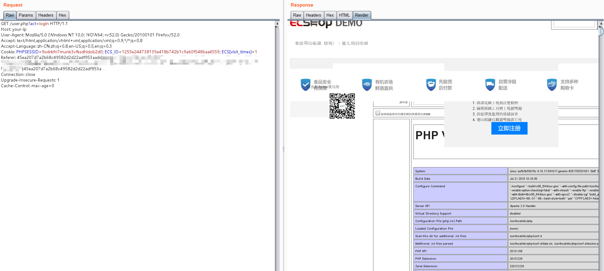

# ECShop 2.x/3.x SQL注入/任意代码执行漏洞

ECShop是一款B2C独立网店系统，适合企业及个人快速构建个性化网上商店。系统是基于PHP语言及MYSQL数据库构架开发的跨平台开源程序。

其2017年及以前的版本中，存在一处SQL注入漏洞，通过该漏洞可注入恶意数据，最终导致任意代码执行漏洞。其3.6.0最新版已修复该漏洞，vulhub中使用其2.7.3最新版与3.6.0次新版进行漏洞复现。

参考链接：

- http://ringk3y.com/2018/08/31/ecshop2-x代码执行/

## 环境搭建

执行如下命令启动ecshop 2.7.3与3.6.0：

```
docker-compose up -d
```

环境启动后，访问`http://your-ip:8080`将看到2.7.3的安装页面，访问`http://your-ip:8081`将看到3.6.0的安装页面。

依次安装二者，mysql地址填写`mysql`，mysql账户与密码均为`root`，数据库名随意填写，但2.7.3与3.6.0的数据库名不能相同。如图：


## 漏洞复现

参考链接中给出了ecshop 2.x版本的复现POC，我对其稍加修改，使之可以直接返回`phpinfo()`：


参考链接未提到的ecshop 3.x也受这个漏洞影响，其POC稍有不同，且需要绕过WAF：



考虑到影响，暂时不公开POC。漏洞原理已经在参考链接中公布，请大家自行构造利用方法。