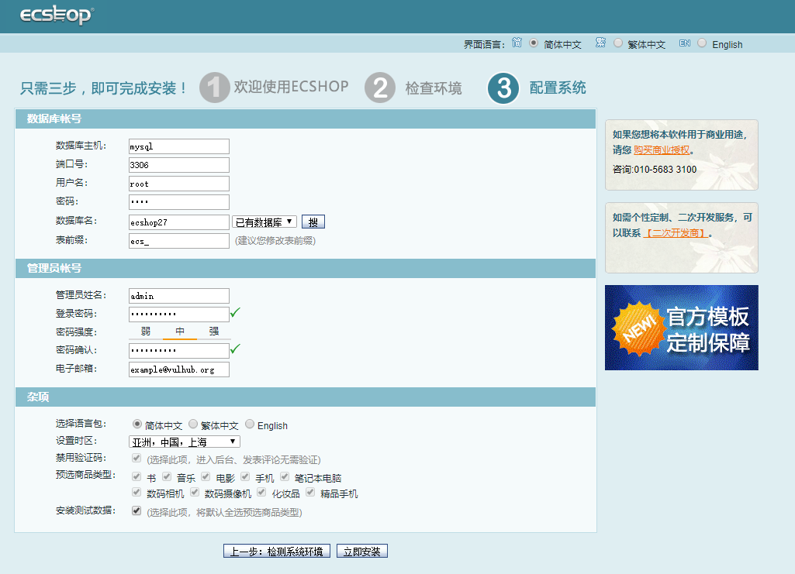

# ECShop 2.x/3.x SQL Injection / Arbitrary Code Execution Vulnerability

ECShop is a B2C independent online store system that is suitable for companies and individuals to quickly build personalized online stores. The system is a cross-platform open source program based on PHP language and MYSQL database architecture.

In its 2017 and previous versions, there was a SQL injection vulnerability that could inject malicious data and eventually lead to arbitrary code execution vulnerabilities. The latest version of 3.6.0 has fixed the vulnerability, and vulhub uses its latest version 2.7.3 and 3.6.0 new versions to reproduce the vulnerability.

Reference link:

- http://ringk3y.com/2018/08/31/ecshop2-x code execution /

## Environment Building

Run the following command to start ecshop 2.7.3 and 3.6.0:

```
Docker-compose up -d
```

After the environment is started, visit `http://your-ip:8080` and you will see the 2.7.3 installation page. Visit `http://your-ip:8081` and you will see the 3.6.0 installation page.

Install both in turn, mysql address fill in `mysql`, mysql account and password are `root`, the database name is free to fill in, but the database names of 2.7.3 and 3.6.0 can not be the same. Figure:



## Vulnerability recurrence

The reference link gives the recurring POC for the ecshop 2.x version, which I modified slightly so that it can return `phpinfo()` directly:


Ecshop 3.x, which is not mentioned in the reference link, is also affected by this vulnerability. Its POC is slightly different and needs to bypass WAF:


In view of the impact, the POC will not be disclosed for the time being. The principle of vulnerability has been announced in the reference link, please construct your own method.