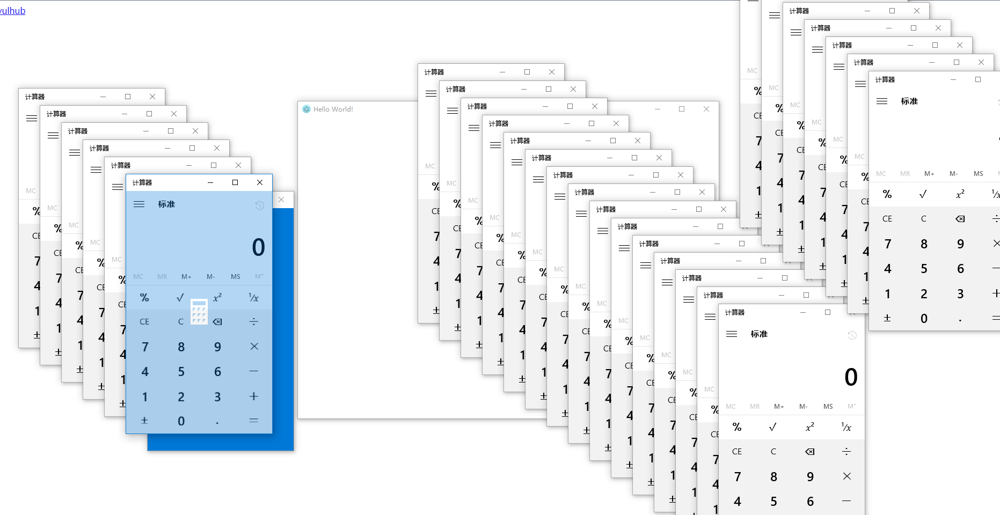

# electron Remote Command Execution Vulnerability (CVE-2018-1000006)

Electron is an open source library developed by Github to build cross-platform desktop applications using HTML, CSS and JavaScript. Electron does this by merging Chromium and Node.js into the same runtime environment and packaging it into applications for Mac, Windows and Linux.

Under Windows, if an application developed by Electron registers a Protocol Handler (allowing the user to call the application in the browser), a parameter injection vulnerability may occur and eventually cause arbitrary commands to be executed on the user side.

Reference link: [Electron < v1.8.2-beta.4 Remote Command Execution Vulnerability - [CVE-2018-1000006]] (https://xianzhi.aliyun.com/forum/topic/1990)

## Compiling APP

Execute the following command to compile an application that contains a vulnerability:

```
Docker-compose run -e ARCH=64 --rm electron
```

In the above command, since the software needs to run on the Windows platform, it is necessary to set the value of the ARCH to the number of bits of the platform: 32 or 64.

After the compilation is complete, execute the following command to start the web service:

```
Docker-compose run --rm -p 8080:80 web
```

At this point, visit `http://your-ip:8080/` to see the POC page.

## Recurring vulnerabilities

First, on the POC page, click on the first link and download the compiled software `vulhub-app.tar.gz`. After the download is complete, extract it and run it once:


This time the Protocol Handler will be registered.

Then, go back to the POC page and click on the second link. The target software and calculator will pop up:



> If it is not successful, it may be the browser reason. After testing, the new Chrome browser will call vulhub-app when it clicks on the POC, but it will not trigger the vulnerability.