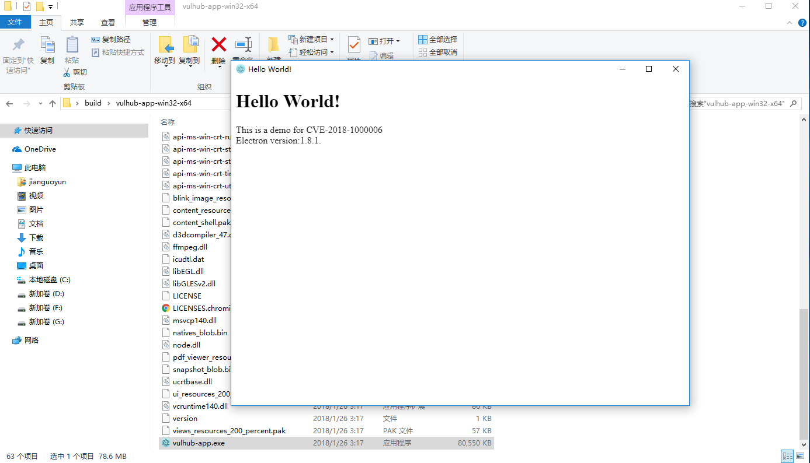
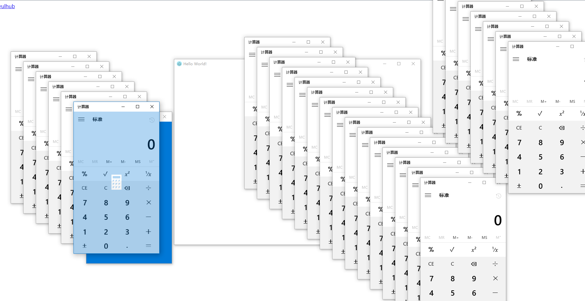

# electron 远程命令执行漏洞（CVE-2018-1000006）

Electron是由Github开发，用HTML，CSS和JavaScript来构建跨平台桌面应用程序的一个开源库。 Electron通过将Chromium和Node.js合并到同一个运行时环境中，并将其打包为Mac，Windows和Linux系统下的应用来实现这一目的。

在Windows下，如果Electron开发的应用注册了Protocol Handler（允许用户在浏览器中召起该应用），则可能出现一个参数注入漏洞，并最终导致在用户侧执行任意命令。

参考链接：[Electron < v1.8.2-beta.4 远程命令执行漏洞—【CVE-2018-1000006】](https://xianzhi.aliyun.com/forum/topic/1990)

## 编译APP

执行如下命令编译一个包含漏洞的应用：

```
docker-compose run -e ARCH=64 --rm electron
```

上述命令中，因为软件需要在Windows平台上运行，所以需要设置ARCH的值为平台的位数：32或64。

编译完成后，再执行如下命令，启动web服务：

```
docker-compose run --rm -p 8080:80 web
```

此时，访问`http://your-ip:8080/`即可看到POC页面。

## 复现漏洞

首先，在POC页面，点击第一个链接，下载编译好的软件`vulhub-app.tar.gz`。下载完成后解压，并运行一次：



这一次将注册Protocol Handler。

然后，再回到POC页面，点击第二个链接，将会弹出目标软件和计算器：



> 如果没有成功，可能是浏览器原因。经测试，新版Chrome浏览器点击POC时，会召起vulhub-app，但不会触发该漏洞。
