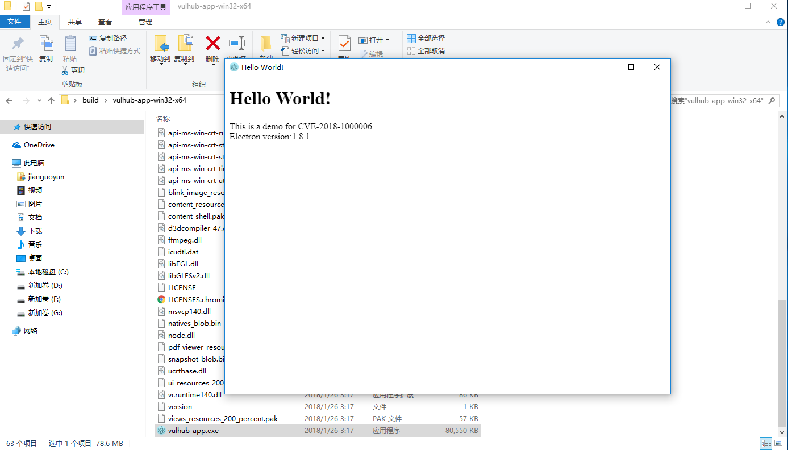
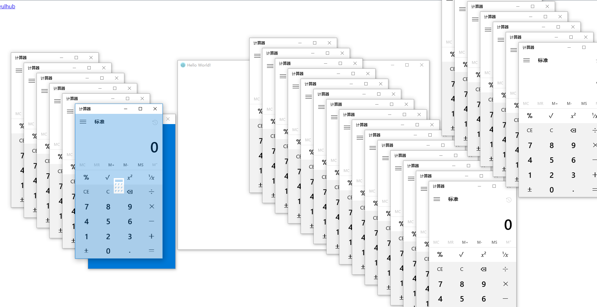

# electron 远程命令执行漏洞（CVE-2018-1000006）

Electron 是由 Github 开发，用 HTML，CSS 和 JavaScript 来构建跨平台桌面应用程序的一个开源库。Electron 通过将 Chromium 和 Node.js 合并到同一个运行时环境中，并将其打包为 Mac，Windows 和 Linux 系统下的应用来实现这一目的。

在 Windows 下，如果 Electron 开发的应用注册了 Protocol Handler（允许用户在浏览器中召起该应用），则可能出现一个参数注入漏洞，并最终导致在用户侧执行任意命令。

参考链接：[Electron < v1.8.2-beta.4 远程命令执行漏洞—【CVE-2018-1000006】](https://xianzhi.aliyun.com/forum/topic/1990)

## 编译 APP

执行如下命令编译一个包含漏洞的应用：

```
docker compose run -e ARCH=64 --rm electron
```

上述命令中，因为软件需要在 Windows 平台上运行，所以需要设置 ARCH 的值为平台的位数：32 或 64。

编译完成后，再执行如下命令，启动 web 服务：

```
docker compose run --rm -p 8080:80 web
```

此时，访问 `http://your-ip:8080/` 即可看到 POC 页面。

## 复现漏洞

首先，在 POC 页面，点击第一个链接，下载编译好的软件 `vulhub-app.tar.gz`。下载完成后解压，并运行一次：



这一次将注册 Protocol Handler。

然后，再回到 POC 页面，点击第二个链接，将会弹出目标软件和计算器：



> 如果没有成功，可能是浏览器原因。经测试，新版 Chrome 浏览器点击 POC 时，会召起 vulhub-app，但不会触发该漏洞。
